# Phase-82 design pack — what we buy now, and what we should buy in an overpriced market

**Step 82.4.** Diagrams and ranking procedure written **before** the 82.3
backtest numbers existed (pass A launched 2026-08-03T18:19:28Z). Result tables
are filled from the run artifacts, transcribed rather than retyped.

---

## 0. The four things below are NOT peers

This is the single most important thing in the pack, and it survives whatever
the numbers say.

**Column 1 is the live funnel** — the thing that actually spends money.
**Columns 2–4 are backtest label methods** — they score research runs and have
never selected a live trade.

`autonomous_loop.py:431` loads `optimizer_best.json`, but the `strategy` key is
consumed at `:1649` as a **heartbeat label** (`decided_strategy ==
prior_strategy` every cycle), and the in-code comment at `:1644` reads "strategy
router (deferred to phase-31)". No `STRATEGY_REGISTRY` label method executes in
the live path.

**Consequence: winning this bake-off changes nothing live.** While
`paper_analyze_top_n = 5` (`autonomous_loop.py:1035`) stands and no
registry-to-live bridge exists, a better label method is a better *research*
artifact. That is why the top recommended action below is the bridge, not a
strategy swap.

---

## 1. Decision flows, side by side

Read each column top to bottom. Nodes at the same row are the same pipeline
stage, so differences read across. Highlighted nodes are where a column departs
from the incumbent.

```mermaid
flowchart LR

  subgraph INC["① INCUMBENT — live funnel (spends money)"]
    direction TB
    I1["Universe<br/>US+EU+KR ~583"] --> I2["Screen: MOMENTUM only<br/>momentum/RSI/SMA → top 10"]
    I2 --> I3["Regime gate<br/>NONE"]
    I3 --> I4["Sizing<br/>Risk Judge %, default 10% NAV"]
    I4 --> I5["Exit<br/>8% stop + 8% trail<br/>NO take-profit, NO time barrier"]
  end

  subgraph SR["② stretch_regime — lens (a)+(d)"]
    direction TB
    S1["Universe<br/>backtest sample"] --> S2["Signal<br/>σ-barriers from annualized_volatility"]
    S2 --> S3["Regime gate<br/>SPY turbulence: short vol ÷ long vol"]
    S3 --> S4["Sizing<br/>via label rate — turbulence widens<br/>the up-barrier ⇒ fewer BUY labels"]
    S4 --> S5["Exit<br/>forward walk to ±σ barrier<br/>cost-adjusted"]
  end

  subgraph QP["③ qarp — lens (b)"]
    direction TB
    Q1["Universe<br/>backtest sample"] --> Q2["Signal<br/>QARP gate: pe≤25, roe≥0.10,<br/>de≤1.5, margin>0"]
    Q2 --> Q3["Regime gate<br/>NONE — defensive by selection"]
    Q3 --> Q4["Sizing<br/>non-candidates return None<br/>⇒ excluded from training"]
    Q4 --> Q5["Exit<br/>asymmetric σ-barrier<br/>TP 1.0σ / SL 1.5σ"]
  end

  subgraph RS["④ reversion_sigma — lens (c)"]
    direction TB
    R1["Universe<br/>backtest sample"] --> R2["Signal<br/>z = sma_50_distance ÷ σ<br/>|z| ≥ 1.0"]
    R2 --> R3["Regime gate<br/>NONE"]
    R3 --> R4["Sizing<br/>no-signal returns None<br/>⇒ excluded, not neutral"]
    R4 --> R5["Exit<br/>revert half the gap<br/>or 1.5σ stop, cost-adjusted"]
  end

  classDef diff fill:#1e3a5f,stroke:#4a90d9,color:#e6f0fa
  classDef live fill:#4a1e1e,stroke:#d94a4a,color:#fae6e6
  class I1,I2,I3,I4,I5 live
  class S3,S4,Q2,Q4,R2,R4 diff
```

**Why the columns repeat nodes instead of sharing them:** all three candidates
call the same `_sigma_barriers` helper, but a single shared node linked across
subgraphs would force Mermaid to discard `direction TB` — "if any of a
subgraph's nodes are linked to the outside, subgraph direction will be ignored"
— and flatten all four columns into the parent's left-to-right flow. The
repetition is deliberate.

### What reads across the rows

| stage | incumbent | stretch_regime | qarp | reversion_sigma |
|---|---|---|---|---|
| screen | momentum only | — | fundamentals gate | overextension gate |
| **regime gate** | **none** | **SPY turbulence** | none | none |
| exposure control | none | via label rate | via exclusion | via exclusion |
| take-profit | **none** | σ barrier | 1.0σ | half-gap |
| time barrier | **none** | horizon | horizon | mr horizon |
| cost-adjusted | n/a | yes | yes | yes |

The incumbent is the only column with **no regime input, no take-profit and no
time barrier**. That is the finding deliverable 1 established and it is what the
candidates are built against.

---

## 2. Ranking procedure — PRE-REGISTERED

Fixed in `contract.md` before any 82.3 number was visible. A rule chosen after
seeing results is a rationalisation.

1. **Gates (binary, un-tradeable):** `DSR ≥ 0.95`, `PBO ≤ 0.5`, net-of-cost
   return `> 0`. A failure is reported as failed and is **not ranked**.
2. **Pareto frontier** over (net-of-cost return, PBO, turnover) among
   gate-passers. Dominated entries are listed as dominated, not scored.
3. **Lexicographic tie-break, declared order:** PBO (lower) → net-of-cost
   return (higher) → turnover (lower).

No weighted composite: arXiv:2508.00129 documents rank reversal and
transitivity violation as fundamental to weighted MCDA, and a composite would
hide the DSR-vs-PBO conflict this pack exists to expose. Matches the
gate-then-rank vocabulary already in `rotation_log.jsonl`.

---

## 3. Caveats that bound every number below

1. **Trial count.** N is not 4 and not 8 — it includes the phase-82.2
   label-design iterations. Under-declaring N inflates DSR (Bailey et al.).
2. **These are back-tested results.** GIPS prohibits presenting them linked to,
   or adjacent-as-continuation with, actual performance. They must never be read
   as continuous with the live paper book (+18.86%, Sharpe 3.32).
3. **`qarp` is NOT EVALUABLE on the full sample.**
   `financial_reports.historical_fundamentals` holds 4,798 rows and **zero dated
   before 2024-06-30** — 81.2% of the 2018-2025 window has no fundamentals at
   all. Not a missed backfill: `ingest_fundamentals` reads
   `yf.Ticker().quarterly_financials`, and yfinance serves only ~5-7 recent
   quarters (measured 2026-08-03). Queued as **82.21**.
4. **`reversion_sigma` losses are confounded.** `backtest_engine.py:665` sets
   `horizon_days = holding_days * 1.5` regardless of strategy, so a 15-day label
   horizon gets a 135-day purge — a ~9× over-purge that starves it of training
   samples. Conservative on leakage, so a **win is clean; a loss is
   inconclusive**. Queued as **82.19**.
5. **Two passes, different evidential weight, never merged.** Pass A:
   2018-2025, 3 strategies, ~27 walk-forward windows. Pass B: 2024-07..2025-12,
   4 strategies, ~6 windows in a single regime — thin, and reported as such.
6. **Net of commission only.** `total_return_pct` already deducts commission on
   every fill; there is no slippage, spread or market-impact model.
7. **PBO is per strategy**, columns = K=8 configs of the same model (Bailey
   Algorithm 2.3). A PBO computed from per-window returns would be meaningless:
   `compute_pbo` returns **0.0 silently when T < 32**, and 0.0 **passes** the
   ≤0.5 gate. Daily NAV returns are used (T ≈ 1,900).

---

## 4. Pass A — full sample 2018-01-01 … 2025-12-31 (3 strategies)

> _Populated from `backend/backtest/experiments/results/*_phase_82_3_full_sample_3strat.json`
> when the run completes. 24 runs at ~20.3 min each._

| strategy | DSR | PBO | turnover | net-of-cost return | gates |
|---|---|---|---|---|---|
| triple_barrier (incumbent) | — | — | — | — | — |
| stretch_regime | — | — | — | — | — |
| reversion_sigma | — | — | — | — | — |

## 5. Pass B — fundamentals-covered window 2024-07-01 … 2025-12-31 (4 strategies)

> _Populated from `..._phase_82_3_short_window_4strat.json`. **Thin evidence:**
> ~6 walk-forward windows in one regime. Not comparable with Pass A and not to
> be merged with it._

| strategy | DSR | PBO | turnover | net-of-cost return | gates |
|---|---|---|---|---|---|
| triple_barrier (incumbent) | — | — | — | — | — |
| stretch_regime | — | — | — | — | — |
| qarp | — | — | — | — | — |
| reversion_sigma | — | — | — | — | — |

---

## 6. Ranked recommendation

> _Filled by applying §2 mechanically to §4–5 once populated._

**What is already determined, independent of the numbers:** per §0, no result
here can change live behaviour. The registry does not drive live selection, and
turnover is capped upstream at five analysed names per cycle. So the highest-value
queued action is the **registry-to-live bridge (82.6)** plus the throughput and
diversification levers identified in 82.1 — not a strategy swap.
