# Phase-82 design pack — what we buy now, and what we should buy in an overpriced market

**Step 82.4.** Diagrams and ranking procedure written **before** the 82.3
backtest numbers existed (pass A launched 2026-08-03T18:19:28Z). Result tables
are filled from the run artifacts, transcribed rather than retyped.

---

## 0. The four things below are NOT peers

This is the single most important thing in the pack, and it survives whatever
the numbers say.

**Column 1 is the live funnel** — the thing that actually spends money.
**Columns 2–4 are backtest label methods** — they score research runs and have
never selected a live trade.

`backend/services/autonomous_loop.py:431` loads `optimizer_best.json`, but the `strategy` key is
consumed at `backend/services/autonomous_loop.py:1649` as a **heartbeat label** (`decided_strategy ==
prior_strategy` every cycle), and the in-code comment at `backend/services/autonomous_loop.py:1644` reads "strategy
router (deferred to phase-31)". No `STRATEGY_REGISTRY` label method executes in
the live path.

**Consequence: winning this bake-off changes nothing live.** While
`paper_analyze_top_n = 5` (`backend/services/autonomous_loop.py:1035`) stands and no
registry-to-live bridge exists, a better label method is a better *research*
artifact. That is why the top recommended action below is the bridge, not a
strategy swap.

---

## 1. Decision flows, side by side

Read each column top to bottom. Nodes at the same row are the same pipeline
stage, so differences read across. Highlighted nodes are where a column departs
from the incumbent.

```mermaid
flowchart LR

  subgraph INC["① INCUMBENT — live funnel (spends money)"]
    direction TB
    I1["Universe<br/>US+EU+KR ~583"] --> I2["Screen: MOMENTUM only<br/>momentum/RSI/SMA → top 10"]
    I2 --> I3["Regime gate<br/>NONE"]
    I3 --> I4["Sizing<br/>Risk Judge %, default 10% NAV"]
    I4 --> I5["Exit<br/>8% stop + 8% trail<br/>NO take-profit, NO time barrier"]
  end

  subgraph SR["② stretch_regime — lens (a)+(d)"]
    direction TB
    S1["Universe<br/>backtest sample"] --> S2["Signal<br/>σ-barriers from annualized_volatility"]
    S2 --> S3["Regime gate<br/>SPY turbulence: short vol ÷ long vol"]
    S3 --> S4["Sizing<br/>via label rate — turbulence widens<br/>the up-barrier ⇒ fewer BUY labels"]
    S4 --> S5["Exit<br/>forward walk to ±σ barrier<br/>cost-adjusted"]
  end

  subgraph QP["③ qarp — lens (b)"]
    direction TB
    Q1["Universe<br/>backtest sample"] --> Q2["Signal<br/>QARP gate: pe≤25, roe≥0.10,<br/>de≤1.5, margin>0"]
    Q2 --> Q3["Regime gate<br/>NONE — defensive by selection"]
    Q3 --> Q4["Sizing<br/>non-candidates return None<br/>⇒ excluded from training"]
    Q4 --> Q5["Exit<br/>asymmetric σ-barrier<br/>TP 1.0σ / SL 1.5σ"]
  end

  subgraph RS["④ reversion_sigma — lens (c)"]
    direction TB
    R1["Universe<br/>backtest sample"] --> R2["Signal<br/>z = sma_50_distance ÷ σ<br/>|z| ≥ 1.0"]
    R2 --> R3["Regime gate<br/>NONE"]
    R3 --> R4["Sizing<br/>no-signal returns None<br/>⇒ excluded, not neutral"]
    R4 --> R5["Exit<br/>revert half the gap<br/>or 1.5σ stop, cost-adjusted"]
  end

  classDef diff fill:#1e3a5f,stroke:#4a90d9,color:#e6f0fa
  classDef live fill:#4a1e1e,stroke:#d94a4a,color:#fae6e6
  class I1,I2,I3,I4,I5 live
  class S3,S4,Q2,Q4,R2,R4 diff
```



### Why these are mermaid and not FigJam

The step asked for FigJam boards via the Figma MCP. They are mermaid instead,
and this is the record of why.

**Figma MCP reachability, checked at capture time (2026-08-03):** the connector
WAS reachable — `whoami` returned the account and plan. What it returned is the
constraint: a **View seat on a Starter plan**, which Figma's own rate-limit doc
caps at **6 MCP tool calls per MONTH** (`View, Collab` seat row; only `Dev`/`Full`
seats get 200+/day). Building and verifying a four-column board would have
consumed most of a month's quota in one sitting, and a failed write on a
read-only seat would have spent calls for nothing.

**Operator decision, 2026-08-03 via AskUserQuestion:** mermaid now, FigJam later
on request. Mermaid costs zero quota, lives in the repo, and diffs in git.

**FigJam URLs: none — no board was created.** This is a deliberate substitution,
not an omission or a failure. The diagram above is render-verified
(`@mermaid-js/mermaid-cli`: 4 subgraphs, 5 nodes each, `direction TB` preserved
on all four, zero cross-subgraph edges, 38 KB SVG). If a board is wanted later,
these four columns port directly.

This is also why no verification criterion for this step names Figma: the MCP is
a claude.ai session connector, absent in headless runs, so a criterion depending
on it would make the step uncloseable for reasons unrelated to the work.

**Why the columns repeat nodes instead of sharing them:** all three candidates
call the same `_sigma_barriers` helper, but a single shared node linked across
subgraphs would force Mermaid to discard `direction TB` — "if any of a
subgraph's nodes are linked to the outside, subgraph direction will be ignored"
— and flatten all four columns into the parent's left-to-right flow. The
repetition is deliberate.

### What reads across the rows

| stage | incumbent | stretch_regime | qarp | reversion_sigma |
|---|---|---|---|---|
| screen | momentum only | — | fundamentals gate | overextension gate |
| **regime gate** | **none** | **SPY turbulence** | none | none |
| exposure control | none | via label rate | via exclusion | via exclusion |
| take-profit | **none** | σ barrier | 1.0σ | half-gap |
| time barrier | **none** | horizon | horizon | mr horizon |
| cost-adjusted | n/a | yes | yes | yes |

The incumbent is the only column with **no regime input, no take-profit and no
time barrier** — the screen ranks on momentum only
(`backend/tools/screener.py:252`), sizing comes from the Risk Judge's
`recommended_position_pct` (`backend/services/portfolio_manager.py:391`), the
stop is synthesised at `backend/services/paper_trader.py:296` and enforced at
`backend/services/paper_trader.py:778`, and the scale-out take-profit ladder
(`backend/services/paper_trader.py:797`) is disabled by
`paper_scale_out_enabled`. That is the finding deliverable 1 established and it is what the
candidates are built against.

---

## 2. Ranking procedure — PRE-REGISTERED

Fixed in `contract.md` before any 82.3 number was visible. A rule chosen after
seeing results is a rationalisation.

1. **Gates (binary, un-tradeable):** `DSR ≥ 0.95`, `PBO ≤ 0.5`, net-of-cost
   return `> 0`. A failure is reported as failed and is **not ranked**.
2. **Pareto frontier** over (net-of-cost return, PBO, turnover) among
   gate-passers. Dominated entries are listed as dominated, not scored.
3. **Lexicographic tie-break, declared order:** PBO (lower) → net-of-cost
   return (higher) → turnover (lower).

No weighted composite: arXiv:2508.00129 documents rank reversal and
transitivity violation as fundamental to weighted MCDA, and a composite would
hide the DSR-vs-PBO conflict this pack exists to expose. Matches the
gate-then-rank vocabulary already in `rotation_log.jsonl`.

---

## 3. Caveats that bound every number below

1. **Trial count.** N is not 4 and not 8 — it includes the phase-82.2
   label-design iterations. Under-declaring N inflates DSR (Bailey et al.).
2. **These are back-tested results.** GIPS prohibits presenting them linked to,
   or adjacent-as-continuation with, actual performance. They must never be read
   as continuous with the live paper book (+18.86%, Sharpe 3.32).
3. **`qarp` is NOT EVALUABLE on the full sample.**
   `financial_reports.historical_fundamentals` holds 4,798 rows and **zero dated
   before 2024-06-30** — 81.2% of the 2018-2025 window has no fundamentals at
   all. Not a missed backfill: `ingest_fundamentals`
   (`backend/backtest/data_ingestion.py:215`) reads
   `yf.Ticker().quarterly_financials`, and yfinance serves only ~5-7 recent
   quarters (measured 2026-08-03). Queued as **82.21**.
4. **`reversion_sigma` losses are confounded.** `backend/backtest/backtest_engine.py:665` sets
   `horizon_days = holding_days * 1.5` regardless of strategy, so a 15-day label
   horizon gets a 135-day purge — a ~9× over-purge that starves it of training
   samples. Conservative on leakage, so a **win is clean; a loss is
   inconclusive**. Queued as **82.19**.
5. **Two passes, different evidential weight, never merged.** Pass A:
   2018-2025, 3 strategies, ~27 walk-forward windows. Pass B: 2024-07..2025-12,
   4 strategies, ~6 windows in a single regime — thin, and reported as such.
6. **Net of commission only.** `total_return_pct` already deducts commission on
   every fill; there is no slippage, spread or market-impact model.
7. **TRIAL DIVERSITY IS AXIS-DEPENDENT — measure it, do not assume it.**
   Measured live during pass A across the first three `triple_barrier` configs:

   | config | Sharpe | trades |
   |---|---|---|
   | d3_l10_r0.05 | 0.6090 | 1004 |
   | d3_l10_r0.1 | 0.6090 | 1004 |
   | d3_l20_r0.05 | 0.5376 | 982 |

   `learning_rate` (0.05 -> 0.1) moves essentially nothing: identical trade
   counts and a Sharpe delta of 5e-05. `min_samples_leaf` (10 -> 20) moves
   Sharpe by **-12%** and changes the trade count. So the grid DOES produce
   genuine column diversity, just not on every axis.

   **A NOTE ON HOW THIS CAVEAT WAS WRITTEN.** Its first version, drafted after
   only the two `learning_rate` runs, claimed "the model hyperparameters barely
   move the strategy" and inferred that PBO would be near-degenerate. The third
   run falsified that. It was a generalisation from one axis to all axes — the
   same partial-look error this phase has produced repeatedly. It is corrected
   here rather than quietly rewritten, because the failure mode is the point.

   PBO still requires a diversity number rather than an assumption: CSCV ranks
   the K columns against each other, so correlated columns weaken it however
   large N is. A mean-pairwise-column-correlation diagnostic is computed by the
   runner, but **pass A had already loaded the module and will not carry it**;
   for pass A the evidence is the per-config spread in
   `handoff/logs/82_3_progress.jsonl`. Pass B carries the computed number.

8. **HOLDING PERIOD IS AN OUTCOME, NOT A TREATMENT — comparisons that use it
   as an explanatory variable are TAUTOLOGICAL.** A trade stopped out on day 1
   has a one-day holding period *by construction*: the stop caused the short
   hold, and the short hold did not cause the loss. So a statement like
   "positions held ≥20 days won 92% of the time versus 33% for those held ≤6
   days" — which is literally true of the live book (measured 2026-08-03 across
   its 32 closed round-trips: 13 long holds, 92% win, +29.52% mean; 15 short
   holds, 33% win, −2.75% mean) — carries almost no information about what to
   *do*. Selecting for longer holds does not convert losers into winners; it
   merely removes the stop that was defining the short hold.

   The same trap applies to any exit-quality metric conditioned on duration,
   and to reading `avg_holding_days_win` against `avg_holding_days_loss` in
   `trade_statistics`. **The non-tautological finding from the same data is
   stop PLACEMENT, not hold length:** 10 of 32 round-trips exited within 0.5pp
   of their worst point, which says the 8% entry-relative stop is inside the
   noise band of high-beta names — a fact about the stop, not about patience.
   That is why all three candidates set barriers in σ units
   (`_sigma_barriers`, `backend/backtest/backtest_engine.py:1322`) rather than
   in fixed percentages.

   **Reproduce the live-book numbers in this caveat** (they carry the pack's
   only actionable non-tautological recommendation, so they must be checkable):

   ```sql
   -- 32 closed round-trips; hold-length split; exits at the worst point
   SELECT
     COUNTIF(holding_days >= 20)                                   AS long_holds,
     COUNTIF(holding_days >= 20 AND realized_pnl_pct > 0)          AS long_wins,
     COUNTIF(holding_days <= 6)                                    AS short_holds,
     COUNTIF(holding_days <= 6  AND realized_pnl_pct > 0)          AS short_wins,
     COUNTIF(realized_pnl_pct < 0
             AND ABS(realized_pnl_pct - mae_pct) < 0.5)            AS exited_at_worst,
     COUNT(*)                                                      AS closed_round_trips
   FROM `sunny-might-477607-p8.financial_reports.paper_trades`
   WHERE action = 'SELL' AND realized_pnl_pct IS NOT NULL;  -- location: us-central1
   ```

   The `+18.86% / Sharpe 3.32` figures in caveat 2 are the operator's
   2026-07-31 dashboard capture, reproduced live from
   `GET /api/paper-trading/portfolio` and `/api/paper-trading/metrics`.

9. **THE PBO FIGURES ARE N=8 — SUGGESTIVE, NOT GATE-GRADE.** Each PBO above is
   computed from a matrix of shape (T, N) = (1661, **8**) — eight configurations
   per strategy. Bailey/Borwein/López de Prado/Zhu state that "if the investor
   is sensitive to values of φ < 1/10 ... **N >> 10 is required**"; the R
   reference implementation uses N=100. So these numbers order the strategies
   credibly but should NOT be read as a promotion-grade measurement.

   What they ARE compliant on: Algorithm 2.3 warns that for a **guided search**
   the columns must be "the final outcome of each guided search ... and not the
   intermediate steps". These columns come from a **fixed 2×2×2 factorial**
   (`scripts/harness/run_82_3_candidate_backtests.py:71`) with
   `trader.full_reset()` per run, so each column is an independent
   configuration run to completion — not an adaptive trajectory. Stacking the
   optimizer's own greedy iterations would NOT satisfy this, which is why
   `QuantOptimizer`'s ten trials cannot be reused as a PBO matrix.

   Raising the trial floor is queued as its own step.

10. **PBO is per strategy**, columns = K=8 configs of the same model (Bailey
   Algorithm 2.3). A PBO computed from per-window returns would be meaningless:
   `compute_pbo` returns **0.0 silently when T < 32**, and 0.0 **passes** the
   ≤0.5 gate. Daily NAV returns are used (T ≈ 1,900).

---

## 4. Pass A — full sample 2018-01-01 … 2025-12-31 (3 strategies)

Source: `results/20260804T025319Z_phase_82_3_full_sample_3strat.json`.
24 runs (K=8 factorial per strategy), ~27 walk-forward windows,
`macro_point_in_time_enabled: true`. Medians across the 8 configs; DSR is
undeflated (`num_trials=1`), i.e. the **optimistic bound**.

| strategy | DSR (med) | DSR range | PBO | turnover | net return | trades | gates |
|---|---|---|---|---|---|---|---|
| `triple_barrier` (incumbent) | 0.6117 | 0.559–0.632 | **0.7486** | 8.75 | +82.75% | 1004 | **0/3** |
| `stretch_regime` | 0.5353 | 0.391–0.810 | **0.1960** | 9.50 | +56.33% | 746 | **0/3** |
| `reversion_sigma` | 0.6061 | 0.577–0.693 | **0.3968** | 10.03 | +77.86% | 1048 | **0/3** |

**Gate outcome: 0 of 3 pass.** Every strategy fails `DSR ≥ 0.95`. The incumbent
additionally fails `PBO ≤ 0.5`. Stages 2 and 3 of the ranking are therefore
never reached and **no winner is declared** — that is the pre-registered
procedure operating as designed, not an absence of analysis.

### The incumbent's PBO is the headline

`triple_barrier` scores **PBO = 0.7486**, far above the 0.5 veto. PBO (`backend/backtest/analytics.py:184`) is the
probability that the configuration selected as best in-sample lands *below the
median out-of-sample*; at 0.75 the in-sample search is **anti-predictive** —
optimizing this strategy actively selects configurations that fail forward.

This number had **never been computed** in this system (`compute_pbo` exists at `backend/backtest/analytics.py:184`; `generate_report` never calls it and no
`results/*.json` before today carried a `pbo` field). It is computed here on the
strategy that `optimizer_best.json` names as best — the same file whose
DSR 0.9526 belongs to a different run four months earlier (step **82.22**).

### The ordering inverts on the honest metric

By PBO — informational only, since all three failed the gates:

1. `stretch_regime` **0.196** — most robust by a wide margin
2. `reversion_sigma` **0.397** — also under the veto line
3. `triple_barrier` **0.749** — the incumbent, worst

The incumbent wins on raw return (+82.75%) and loses decisively on overfitting
risk. **Both candidates beat it on PBO; both lose on return.** A weighted
composite would have averaged that conflict away, which is exactly why §2
forbids one.

### Config-spread reading

`stretch_regime` has the widest Sharpe spread (0.391–0.825) and the *lowest*
PBO. Those are not in tension: the spread reflects genuine hyperparameter
sensitivity, while PBO asks whether the in-sample ranking of those configs
survives out-of-sample. It does, for `stretch_regime`, better than for anything
else measured.

## 5. Pass B — fundamentals-covered window 2024-07-01 … 2025-12-31 (4 strategies)

Source: `results/20260804T041628Z_phase_82_3_short_window_4strat.json`.
32 runs, ~6 walk-forward windows in a single regime.
**THIN EVIDENCE. Not comparable with Pass A and never to be merged with it.**

| strategy | DSR (med) | PBO | turnover | net return | trades | column corr |
|---|---|---|---|---|---|---|
| `triple_barrier` | 0.7562 | 0.2415 | 1.75 | +7.92% | 80 | 0.974 |
| `stretch_regime` | 0.7414 | 0.6889 | 1.76 | +6.23% | 80 | 0.971 |
| `qarp` | 0.7703 | 0.2674 | 1.06 | +7.35% | 59 | 0.979 |
| `reversion_sigma` | 0.7460 | 0.4368 | 1.81 | +8.97% | 80 | 0.967 |

**Gate outcome: 0 of 4 pass** (all fail `DSR ≥ 0.95`).

Three reasons this table is weak, all measured rather than asserted:

- **Column correlations 0.967–0.979.** The K=8 trials are near-identical on this
  window, so CSCV is ranking noise and every PBO here is correspondingly weak.
- **The short window flatters everything.** Median Sharpe rises from 0.54–0.59
  (Pass A) to 1.00–1.75 (Pass B), and DSR from 0.54–0.61 to 0.74–0.77. Six
  windows in one regime is not evidence of skill.
- **`stretch_regime`'s PBO flips 0.196 → 0.689** between passes. A statistic
  that unstable across samples cannot carry a promotion decision.

`qarp` posts the best short-window numbers (Sharpe 1.75, DSR 0.77) but is
**not evaluable on the real sample** — see caveat 3.

---

## 6. Ranked recommendation

### 6.1 The ranking, applied mechanically

**No strategy passes the gates. There is no ranked list.** Stage 1 eliminated
all candidates on both passes; stages 2–3 were not reached. Recording the
elimination rather than promoting a least-bad option is the whole purpose of
gating before ranking.

### 6.2 What the evidence actually supports

**(i) Do not promote any of these four strategies.** Not the incumbent, not the
candidates. On the full sample none reaches `DSR ≥ 0.95`, and the incumbent's
`PBO = 0.7486` is an active red flag rather than a near-miss.

**(ii) The promotion gate must be repaired before any promotion decision.** Both
of its terms were compromised — **though a correction is owed on the first, and
it is recorded here rather than quietly amended.**

**What I asserted earlier and what is actually true.** I wrote that
`PBO ≤ 0.5` "was never computed, so the gate ran on one term", implying it
silently promoted. That overstates it. Measured:

| gate | threshold | missing-PBO behaviour | live? |
|---|---|---|---|
| `backend/autoresearch/gate.py:22` `PromotionGate` | `max_pbo = **0.20**` | **fail-CLOSED** — returns `promoted: False, reason: "missing_dsr_or_pbo"` | **YES**, via `backend/autoresearch/friday_promotion.py:59` |
| `backend/services/promotion_gate.py:37` | `PBO_CEILING = 0.5` | fail-OPEN — `challenger.get("pbo", 0.0)`, and 0.0 passes | **NO — `evaluate_promotion` has zero callers** |
| `backend/backtest/analytics.py:198` docstring | "PBO > 0.5 is the canonical gate" | n/a | doc only |

So the LIVE gate is **fail-closed and stricter than I said** (0.20, not 0.5), and
`backend/autoresearch/friday_promotion.py:108` defaults a missing PBO to **1.0** — the worst
value — which is also conservative. A missing PBO never silently promoted
anything; it silently *blocked* promotion.

**What survives, and is the real gap:** `generate_report` still never computes
PBO (`backend/backtest/analytics.py:184` `compute_pbo` has callers, but not from the report
path), so no `results/*.json` carries one. Anything flowing from the backtest
lane into the gate is therefore dropped as `missing_dsr_or_pbo` — the gate is
sound, but it is starved. And a **third** finding surfaced while checking:
three different PBO thresholds exist (0.20 live, 0.5 dead, 0.5 documented), one
of them in dead code with a fail-open default.

**The conclusion is unchanged and in fact stronger:** the incumbent's measured
**PBO 0.7486 fails every one of those thresholds.** And `DSR ≥ 0.95` was still
being satisfied by a figure belonging to a different run (82.22, P0).

**(iii) A strategy swap could not change live behaviour anyway.** Per §0, the
registry does not drive live selection and `paper_analyze_top_n = 5` caps
turnover upstream. This was written before the numbers arrived and the numbers
do not disturb it.

**(iv) `stretch_regime` is the most robust thing measured, and that is not an
endorsement.** PBO 0.196 with DSR 0.535 is *robustly mediocre*. Its regime
mechanism is worth keeping as research, not deploying.

**(v) The answer to "what should we buy in an overpriced market" is: not yet
knowable from this system.** The evidence machinery had to be repaired to
produce these numbers at all, and what it now says is that no measured strategy
here has a demonstrable edge. That is a real answer, and more useful than a
ranked list built on a broken gate.

### 6.3 Queued actions, ordered by their MASTERPLAN priority

Priorities below are read from `.claude/masterplan.json`, not assigned here. An
earlier draft labelled 82.6 as P1; it is P2. Ordering by an invented priority
would have misrepresented the queue.

| step | P | action | why the evidence supports it |
|---|---|---|---|
| **82.22** | P0 | Fix `optimizer_best.json` provenance | its DSR 0.9526 belongs to run `52eb3ffe` (2026-03-28), not `60617e0b` (kept=0) |
| **82.23** | P0 | Compute PBO in `generate_report` + enforce it in the gate | measured PBO 0.7486 on the incumbent; the term was never computed |
| **82.7** | P0 | Rotate the FRED key, stop logging credentials in URLs | FRED key written to logs on every ingest |
| **82.21** | P1 | Fundamentals source decision | 81.2% of the sample is fundamentally blind; `qarp` not evaluable |
| **82.19** | P2 | Strategy-aware purge horizon | `reversion_sigma` purged 135d against a 15d label horizon |
| **82.24** | P2 | Re-run the comparison after the gate is fixed | today's numbers are the pre-repair baseline |
| **82.6** | P2 | Design the registry->live bridge | without it no backtest result can ever change live behaviour |

Steps 82.14/82.16/82.18/82.20 remain queued from earlier in the phase.
