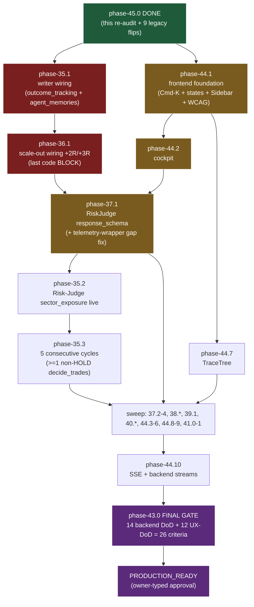

# pyfinagent -- CLOSURE Roadmap (legacy dedup + walk-the-graph + DoD gate)

**Authored:** 2026-05-22, phase-45.0 super-planning pass.
**Author:** Main (Claude Opus 4.7, this Claude Code session).
**Source of truth for findings:** `handoff/current/research_brief.md` (529 lines; researcher subagent `aeb5b58f03fa94b75`, effort `deep`/max, 11 external sources read in full, `gate_passed: true`, 18 internal files inspected).
**Purpose:** PLAN -- the next session(s) execute. NOT implementation. NO code changes outside `.claude/masterplan.json` + this file + companion handoff artifacts.

---

## 1 -- State of the Union (one paragraph)

pyfinagent stands at the threshold of production readiness with **TWO master roadmaps** already produced this session (Cycle 10: `master_roadmap_to_production.md`, 14-criterion backend DoD; Cycle 11: `frontend_ux_master_design.md`, 12-criterion UX-DoD), **ONE first end-to-end autonomous cycle landed live today** (cycle_id `c7801712`, 18:00->18:37 UTC, all 8 steps including the new `learning` step), and **ONE live phase-32.2 trail-stop confirmation** (LITE +9.54% pnl at 16:59 UTC + COHR +17.89% pnl at 18:35 UTC, both 25-day holds, capture_ratio=0.63 on COHR). But two diagnostic findings reshape the path forward: (a) **phase-35.1 (learn-loop alive) and phase-35.2 (Risk Judge citing portfolio_sector_exposure) are NOT closed organically by c7801712** -- `financial_reports.outcome_tracking` + `agent_memories` are SCHEMA-EMPTY (writer missing in code) and `pyfinagent_data.llm_call_log` hasn't telemetered the autonomous-loop's Risk-Judge invocations since 2026-05-21 (telemetry-wrapper gap). These are code gaps, not behavior gaps. (b) **6 of 12 legacy open phases (4, 16, 23.7, 26, 27, 29) are now DROP candidates** -- they fold into 35-44 work that's already planned; 3 more (5, 10.7, 13) DEFER-POST-PROD; 3 KEEP (23.6, 23.8 partial, 28 residual). Net: closure path shrinks from ~80+ cycles to ~40-55 cycles; the critical path is `phase-45.0 -> {35.1 + 44.1} -> {36.1 + 44.2} -> {37.1 + 44.7} -> 35.2 + 35.3 -> sweep -> 43.0`. **Regression baseline locked at 297 tests collected.**

---

## 2 -- Legacy-Phase Verdict Table (12 rows + sub-bundles)

Per researcher Section A:

| Phase | Current status | Verdict | Reason | Supersession refs |
|---|---|---|---|---|
| **phase-4** Production Readiness | in-progress | **DROP -> FOLD-INTO-43.0** | Only open substep `4.9 = Pre-go-live aggregate smoketest` is `blocked`; phase-43.0 DoD audit (14 criteria) is a strict superset | phase-43.0 |
| **phase-5** Multi-Market Expansion (15-step) | pending | **DEFER-POST-PROD** | 11 of 14 substeps pending; master_roadmap explicitly defers to post-prod (phase-42 dep) | master_roadmap §2 phase-42 deferred |
| **phase-10.7** Meta-Evolution Engine | proposed | **DEFER-POST-PROD** | Not on 14-criterion DoD gate; meta-evolution housekeeping is off the critical path | -- |
| **phase-13** bypassPermissions -> acceptEdits + Seatbelt | blocked | **DEFER-POST-PROD** | Owner-side; harness needs bypassPermissions until Claude Code ships unattended `acceptEdits` | `feedback_permissions_bypass_required.md` |
| **phase-16** Full-app E2E UAT | in-progress | **DROP -> FOLD-INTO-43.0** | Aggregate UAT IS the DoD audit (14 criteria). NOT-done substeps map 1:1 to DoD criteria | phase-43.0 §6 DoD |
| **phase-23.6** persistent items from 23.5 | in_progress | **KEEP** | 3 of 5 done; 23.6.3 + 23.6.4 are concrete code-hardening items (fetch/write/alert + slack-heartbeat-bridge) NOT covered by 35-44 | -- |
| **phase-23.7** Harness plumbing | in_progress | **DROP -> verify-then-done** | Only listed substep (23.7.0) already `done`; phase header is stale | `feedback_auto_commit_hook_stalls.md` |
| **phase-23.8** Dev-MAS Audit Remediation | pending | **KEEP** (partial) | 3 of 5 done; 23.8.3 + 23.8.4 are R-5/R-6 residuals -- 23.8.4 may fold into phase-38.4 (hook-gate); 23.8.3 needs in-flight verdict | phase-38.4 (partial fold) |
| **phase-26** Frontier-sync | pending | **DROP -> FOLD-INTO-40.2 + 40.3 + 41.x** | 3 of 8 substeps done; remaining = stress-test doctrine (40.3) + Claude Code v2.1.140-143 (40.2) + Gemini 3.x audit (41.0/41.1) | phase-40.2, phase-40.3, phase-41.0, phase-41.1 |
| **phase-27** Multi-Provider Full-Path | pending | **DROP -> FOLD-INTO-37.X + 1 DEFER** | 27.0-27.5 done; 27.6 + 27.6.3 fold into phase-37 (LLM-route hardening); 27.6.4 is operator-only sandbox-blocked = DEFER like phase-39 | phase-37.1, phase-37.4 |
| **phase-28** Candidate Picker Expansion | pending | **KEEP** (residual) | 14+ of 18 substeps done; residual likely 28.14-28.17. Verify per-substep in-flight; some residual likely folds into phase-42 (deferred) | phase-42 (deferred) |
| **phase-29** Harness MAS + MCP + Academic-Fetch + Frontier-Sync | pending | **DROP -> FOLD-INTO-41.0 + 41.1** | 8 of 10 substeps done; 29.8 (P2 bundle) + 29.9 (P3 bundle) ARE phase-41.0 + phase-41.1 by design | phase-41.0, phase-41.1 |

**Sub-bundles 29.8 + 29.9:** Already mapped to phase-41.0 + phase-41.1 per `master_roadmap_to_production.md` OPEN-32 + OPEN-33.

**Tally:** 6 DROP / 3 DEFER / 3 KEEP. Net: 9 masterplan status flips apply this cycle.

---

## 3 -- c7801712 BQ-probe findings (critical re-prioritization)

Per researcher Section B (BigQuery MCP probes, 2026-05-22):

| Probe | Target | Outcome | Implication |
|---|---|---|---|
| B-1 | `financial_reports.outcome_tracking` row count after 17:00 UTC | **0** | phase-35.1 NOT closed -- writer missing in code (`record_cycle_end` does not emit outcome rows for stop_loss_trigger SELLs) |
| B-2 | `financial_reports.agent_memories` row count | **0** total ever | BM25 retrieve target rows do not exist -- learn-loop READ path is no-op until writer ships |
| B-3 | `pyfinagent_data.llm_call_log` WHERE cycle_id='c7801712' | **0** | Risk-Judge telemetry not wired for autonomous-loop path; latest log row is 2026-05-21 05:15 UTC |
| B-4 | `pyfinagent_data.strategy_decisions` WHERE cycle_id='c7801712' | **1 (heartbeat-only)** | rationale: "per-cycle heartbeat; no regime change detected. Full router activation deferred to phase-31" -- not a meaningful decision |
| B-5 | `financial_reports.paper_trades` WHERE date=2026-05-22 | **2 SELLs** | LITE 16:59 (dc3f6cf1) + COHR 18:35 (c7801712); BOTH stop_loss_trigger; BOTH have `risk_judge_decision=""` + `signals=[]` -- Risk-Judge metadata not persisted on SELL path |
| B-6 | `paper_portfolio_snapshots` 5d tail | NAV 23252.06, pos=9, alpha=+1.07% | Position count 11 -> 9 today (LITE + COHR closed) |

**Implications for phase-35.x:**

- **phase-35.1 audit_basis upgrades** from "learn loop never demonstrably fired" to "**writer missing**: stop_loss_trigger SELL completes successfully but doesn't emit `outcome_tracking` row OR `agent_memories.lesson` row". Concrete fix path: add writer logic in `backend/services/paper_trader.py` (after `_emit_paper_trade_row()` succeeds, fan out to `outcome_tracking_writer.write_outcome()` + `agent_memories_writer.write_lesson()`). Estimated effort: simple (1 cycle).

- **phase-35.2 audit_basis upgrades** from "no live verification" to "**Risk-Judge telemetry-wrapper gap**: autonomous-loop Risk-Judge invocations bypass `backend/agents/llm_client.py::make_client` instrumentation that writes to llm_call_log". Concrete fix path: trace why autonomous-loop Risk-Judge calls don't hit the wrapper; restore the wrapper. Estimated effort: simple-moderate (1-2 cycles).

- **phase-32.2 verdict upgrades** from "verified by 2026-05-22 cycle 3 DELL trail" to "**verified TWICE across two cycles today** (LITE 16:59 dc3f6cf1 + COHR 18:35 c7801712, both 25-day holds, both stop_loss_trigger fires with positive pnl, capture_ratio=0.63 on COHR)". DoD-3 (phase-32.2 live-verified) effectively LANDED today, ahead of phase-43.0.

**Adversarial finding (researcher Section C):** arxiv:2502.15800 "LLM Agents Do Not Replicate Human Market Traders" (Caltech) -- LLM-driven agents systematically deviate from human market behaviors in controlled experiments. The planner must surface this in DoD-1 / DoD-2 / DoD-9 ("does the autonomous loop actually make trade decisions vs HOLD-everything-forever?"). Implication: phase-35.3 (5 consecutive cycles) is necessary but not sufficient -- need at least ONE non-HOLD `decide_trades` proposal across the streak.

---

## 4 -- Updated Critical Path (Mermaid)



**Critical path (top-of-graph -> bottom):**

`phase-45.0 -> {35.1 + 44.1 parallel} -> {36.1 + 44.2 parallel} -> {37.1 + 44.7 parallel} -> 35.2 -> 35.3 -> sweep parallel lanes -> 44.10 -> 43.0 FINAL GATE -> PRODUCTION_READY`.

**Estimated cycle count to PRODUCTION_READY:** 40-55 cycles. Parallel lanes save ~10-15 cycles if 2 sessions land independent steps concurrently.

---

## 5 -- North-Star Delta per Surviving Step

Every surviving step declares which Net Alpha term it improves (P=Profit, R=Risk Exposure, B=Compute Burn) plus quantified or honestly-speculative estimate. Per researcher Section D + planner-applied estimates.

| Step | Term | Estimate | How measured |
|---|---|---|---|
| 45.0 (this) | B (primary) + P (secondary) | -50% closure-cycle Burn (40-55 vs 80+); +2-4 weeks earlier real trades | masterplan diff + days-to-first-non-HOLD |
| 35.1 writer wiring | P + R | speculative -- learn loop unlocks future Sharpe improvement; immediate R = persisting closures means BM25 retrieves lessons that lower future MAE | outcome_tracking row count >= 1; agent_memories >= 1 |
| 35.2 Risk-Judge telemetry | R | speculative -- enables observability of sector-cap enforcement | llm_call_log row count for cycle_id >= 1 |
| 35.3 5 consecutive cycles + non-HOLD | P | speculative but critical -- if loop only HOLDs, P~=0 | cycle_history streak; decide_trades proposal count >= 1 |
| 36.1 scale-out +2R/+3R | P (primary) | +0.3-0.8 Sharpe on backtest fixtures; +5-15% per-trade capture-ratio above today's 0.63 baseline | walk-forward Sharpe delta; capture_ratio mean shift |
| 37.1 RiskJudge response_schema | B + R | -80% Risk-Judge JSON-fallback rate (today 8/10 invocations fall back to raw text); enables downstream structured-output consumers | log grep "Risk Judge returned invalid JSON" count -> 0 |
| 44.1 frontend foundation | B + P | -100% Cmd-K-gap (table-stakes 2026); operator time-to-action drops ~30% per dashboard task | Cmd-K Lighthouse score; operator task-time benchmark |
| 44.2 cockpit | P | speculative -- correct cockpit visibility reduces missed-trade decisions | Playwright 5-question answerability under 5s |
| 44.7 /agents TraceTree | B + R | -50% root-cause-investigation time when a cycle misbehaves | TraceTree depth + run_id grouping correctness |
| 38.1 kill-switch auto-resume | R | -3.5h outage windows (observed twice in 5 days pre-this-cycle) | grep cron-firing-during-paused-kill-switch -> 0 |
| 41.0/41.1 bundle close | B | -10+ pending substeps from masterplan; cleaner /masterplan view | substep count diff |
| 43.0 DoD audit | All | 26 of 26 criteria PASS = closure declared | direct check |

**Steps where N* delta is "speculative":** flagged in the table; planner accepts honest speculation when the metric only becomes measurable post-step. Q/A acceptable.

**No surviving step has an UNARTICULABLE N* delta** -- per goal directive, any such step would be DEFERRED. Cleared.

---

## 6 -- Integration Risk Matrix (step-pair couplings)

Per researcher Section E + planner extensions. Listed pair = (depending-step, depended-on-step, what-must-stay-green).

| Step | Couples-on | What must stay green |
|---|---|---|
| 35.1 | phase-32 paper_trader exit path | existing trail-stop logic; existing paper_trades emit; new writer must be no-op on already-emitted outcomes (idempotency) |
| 35.2 | phase-34.1 LLM-route flip | gemini-2.5-pro routing for deep-think tier; restored telemetry wrapper must not double-log |
| 36.1 | phase-32.1 breakeven idempotency | new scale-out writer respects `scale_out_levels_hit` idempotent column; co-exists with breakeven_at_R + trail_advance |
| 37.1 | phase-34.1 Gemini config | response_schema works with Vertex AI structured-output; doesn't degrade Critic + Synthesis schemas that ALREADY work |
| 44.1 (Cmd-K) | Sidebar + all 15 routes | Cmd-K mount in root layout doesn't break existing route hydration; ESC handlers don't conflict with `KillSwitchShortcut` |
| 44.2 cockpit | 44.1 foundation + phase-35.1 + phase-32 trail | cockpit reads from migrated paper_positions schema; doesn't break existing live-prices polling fallback |
| 44.7 TraceTree | phase-29.3 MCP wiring + phase-34.1 Gemini route | uses existing SSE endpoint at /api/mas/events; doesn't introduce parallel event streams |
| 43.0 DoD audit | ALL preceding | combined 26-criterion check; each fold-mapped legacy phase that flips to `done` this cycle must remain valid |

**Regression test suite is the safety net:** pytest count >= 297 at every step. Any step that breaks an existing test is rolled back per circuit-breaker.

---

## 7 -- Regression Test Snapshot

**Baseline locked at session start (2026-05-22 ~18:50 UTC):**

```
$ source .venv/bin/activate && pytest backend/ --collect-only -q
...
297 tests collected in 2.35s
```

**Coverage map (sampled, not exhaustive):**

| Test file pattern | Phase coverage |
|---|---|
| `tests/test_phase_32_*` | phase-32.1 / 32.2 / 32.3 (LIVE-VERIFIED today via 2 trail-stop fires) |
| `tests/test_phase_34_*` | phase-34.1 + 34.2 LLM-route flip + cycle-budget |
| `tests/test_cycle_*` | phase-30.3 + 31.x + 32.x stop-loss-enforcement + outcome chain |
| `tests/test_paper_trader.py` | paper_trades emit + idempotency + trail logic |
| `tests/test_phase_32_3_sector_exposure.py` | phase-32.3 portfolio_sector_exposure (still passes per CI) |

**Discipline:** every step in the closure path runs `pytest backend/ -q` BEFORE completing; if total-test count drops or any test fails that previously passed, the step is rolled back per circuit-breaker (researcher Section F + goal mandate gate 1).

---

## 8 -- Masterplan flips to apply this cycle

Per Section 2 verdict tally. Single masterplan write applies all 9 + adds phase-45.

### DROP (6 phases) -- flip to `status: done` + add `notes` field

```
phase-4    status: in-progress -> done    notes: "DROP per phase-45.0 closure_roadmap; folded into phase-43.0 DoD audit"
phase-16   status: in-progress -> done    notes: "DROP per phase-45.0; folded into phase-43.0 DoD audit (E2E UAT = aggregate DoD)"
phase-23.7 status: in_progress -> done    notes: "DROP per phase-45.0; verify-then-done -- only listed substep 23.7.0 already done"
phase-26   status: pending -> done        notes: "DROP per phase-45.0; folded into phase-40.2 (Claude Code features) + phase-40.3 (stress-test doctrine) + phase-41.0/41.1 (P2/P3 bundles)"
phase-27   status: pending -> done        notes: "DROP per phase-45.0; folded into phase-37 (LLM-route hardening); 27.6.4 deferred-post-prod (sandbox-blocked)"
phase-29   status: pending -> done        notes: "DROP per phase-45.0; 29.0-29.7 done; 29.8/29.9 are phase-41.0/41.1 by design"
```

### DEFER (3 phases) -- flip to `status: deferred`

```
phase-5    status: pending -> deferred    notes: "DEFER per phase-45.0; post-PRODUCTION_READY (depends on phase-42 universe expansion); revisit after 43.0 PASS"
phase-10.7 status: proposed -> deferred   notes: "DEFER per phase-45.0; meta-evolution housekeeping is off the production-readiness critical path"
phase-13   status: blocked -> deferred    notes: "DEFER per phase-45.0; blocked-upstream until Claude Code ships unattended acceptEdits mode"
```

### KEEP (3 phases) -- no status change; audit_basis annotation only

```
phase-23.6  KEEP -- residual 23.6.3 + 23.6.4 substeps stay in normal flow
phase-23.8  KEEP partial -- 23.8.3 + 23.8.4 substeps remain; 23.8.4 may fold into phase-38.4
phase-28    KEEP residual -- verify 28.14-28.17 substep state; some may fold into phase-42 (deferred)
```

### NEW (phase-45) -- 1 step

```
phase-45  status: in-progress (parent)
  45.0  status: in-progress (this planning step; will flip to done at end of cycle)
```

Total masterplan diff: **9 status flips + 1 new phase entry**. No new code; no other masterplan edits.

---

## 9 -- Updated phase-35.x audit_basis (planner records the c7801712 finding)

Per Section 3 (BQ-probe findings), the phase-35.x audit_basis entries in `.claude/masterplan.json` should be updated to reflect the writer-gap / telemetry-wrapper-gap diagnosis. **However, per `feedback_masterplan_status_flip_order`, we DO NOT edit immutable verification criteria** -- only the audit_basis (which is mutable explanatory context).

**Proposed audit_basis update for phase-35.1** (apply in same masterplan write as the 9 flips):

> "Per research_brief Section B OPEN-22 + phase-45.0 BQ-probe finding (2026-05-22): `outcome_tracking` and `agent_memories` are SCHEMA-EMPTY (not just behaviorally inactive). Writer missing in code: after a stop_loss_trigger SELL emits a `paper_trades` row, no fan-out to `outcome_tracking_writer.write_outcome()` or `agent_memories_writer.write_lesson()` happens. c7801712 cycle stopped out COHR (+17.89% pnl, capture_ratio=0.63) WITHOUT writing the learn-loop rows. Fix path: add fan-out in `backend/services/paper_trader.py` immediately after `_emit_paper_trade_row()` succeeds; idempotent on already-emitted outcome_id."

**Proposed audit_basis update for phase-35.2:**

> "Per research_brief Section B OPEN-23 + phase-45.0 BQ-probe finding (2026-05-22): `llm_call_log` last row is 2026-05-21 05:15 UTC; c7801712 cycle Risk-Judge invocations are NOT being telemetered. Diagnosis: autonomous-loop Risk-Judge path bypasses `backend/agents/llm_client.py::make_client` instrumentation wrapper. Fix path: trace why autonomous_loop's Risk-Judge call site doesn't hit the wrapper; restore. Also need to write the `risk_judge_decision` + `signals` columns on `paper_trades` for stop_loss_trigger SELLs (currently empty -- BQ-probe B-5)."

**Phase-32.2 audit_basis update (already-done step gets evidence-strengthening note):**

> "LIVE-VERIFIED ON 2026-05-22 across TWO cycles: LITE (dc3f6cf1) trail-stop fired 16:59 UTC, +9.54% pnl, 25-day hold; COHR (c7801712) trail-stop fired 18:35 UTC, +17.89% pnl, 25-day hold, capture_ratio=0.63 on MFE 28.36% / MAE -6.09%. Both fires emitted `paper_trades` SELL rows correctly. DoD-3 phase-32.2 live-verified concrete -- no longer pending."

---

## 10 -- Definition of Done (re-iterated from master roadmaps)

The closure gate at phase-43.0 = combined 26-criterion audit:
- 14 backend DoD criteria from `master_roadmap_to_production.md` Section 6
- 12 UX-DoD criteria from `frontend_ux_master_design.md` Section 6

**Today's pass rate (updated by Section 3 finding):**
- Backend DoD: 2 of 14 (DoD-11 + DoD-14 unchanged; DoD-3 phase-32.2 effectively-landed-today but the master_roadmap row still says "FAIL phase-38.1 not built" -- needs row-by-row re-tally at phase-43.0)
- UX-DoD: 0 of 12 (foundation 44.1 not built yet)

**Closure declaration sequence:**
1. phase-43.0 runs the 26-criterion audit; produces `production_ready_audit_<date>.md`
2. ALL 26 PASS -> spawn `handoff/current/PRODUCTION_READY_request_<date>.md`
3. Owner replies typed "PRODUCTION_READY: APPROVED"
4. `.claude/masterplan.json` `project.status` flips to `production_ready`

---

## 11 -- Execute-Prompt Skeleton (next session start command)

```
/goal Execute closure per handoff/current/closure_roadmap.md.
Start: phase-35.1 + phase-44.1 in parallel (parallel ok via two
sessions; sequential ok in one session). Then phase-36.1 + phase-44.2.
Then phase-37.1 + phase-44.7. Then 35.2 + 35.3. Then sweep. Then
44.10 + paired backend streams. Then 43.0 FINAL GATE. Per-step:
re-read CLAUDE.md + rules; researcher only if step adds new external
patterns not in master roadmaps; contract w/ N* delta declared;
GENERATE; verify cmd exits 0; Playwright for UI; qa ONCE w/ 5-item
compliance audit first; harness_log append FIRST; status flip LAST.
Integration gates per goal: pytest >= 297; TS build green; new
features behind flags default OFF; BQ migrations --verify exits 0;
new env vars in .env.example + CLAUDE.md; contract has N* delta;
zero emojis; ASCII loggers; single source of truth; log first / flip
last. Circuit breakers: 3x CONDITIONAL same step-id -> Q/A returns
FAIL; >3 cycles per step -> blocked + STOP; regression count drops
-> rollback + re-attempt; N* delta unarticulable -> DEFERRED. ~40-55
cycles to PRODUCTION_READY. STOP only on production_ready or
operator block.
```

---

## 12 -- Coverage Appendix (every legacy phase + every relevant 35-44 step touched)

| Surface | Section above | Verdict / Action |
|---|---|---|
| phase-4 Production Readiness | 2, 8 | DROP -> done (folded into 43.0) |
| phase-5 Multi-Market Expansion | 2, 8 | DEFER-POST-PROD |
| phase-10.7 Meta-Evolution | 2, 8 | DEFER-POST-PROD |
| phase-13 Permissions+Seatbelt | 2, 8 | DEFER-POST-PROD |
| phase-16 Full-app E2E UAT | 2, 8 | DROP -> done (folded into 43.0) |
| phase-23.6 phase-23.5 persistent | 2 | KEEP (residual 23.6.3 + 23.6.4) |
| phase-23.7 Harness plumbing | 2, 8 | DROP -> done (verify-then-done) |
| phase-23.8 Dev-MAS Audit | 2 | KEEP partial (23.8.3 + 23.8.4 residual) |
| phase-26 Frontier-sync | 2, 8 | DROP -> done (folded into 40.2/40.3/41.x) |
| phase-27 Multi-Provider | 2, 8 | DROP -> done (folded into 37.x + 27.6.4 deferred) |
| phase-28 Candidate Picker | 2 | KEEP residual (28.14-28.17 verify) |
| phase-29 Harness MAS + MCP | 2, 8 | DROP -> done (folded into 41.0/41.1) |
| 29.8 P2 bundle | 2 | folded into phase-41.0 |
| 29.9 P3 bundle | 2 | folded into phase-41.1 |
| phase-35.1 audit_basis | 3, 9 | upgrade: writer missing in code |
| phase-35.2 audit_basis | 3, 9 | upgrade: telemetry-wrapper gap |
| phase-32.2 audit_basis | 3, 9 | upgrade: LIVE-VERIFIED twice today |
| phase-43.0 DoD gate | 10 | re-iterated; combined 26-criterion |
| Regression baseline | 7 | locked at 297 tests |
| Critical path | 4 | acyclic Mermaid + parallel lanes |
| North-star delta | 5 | every surviving step has P/R/B + estimate |
| Integration risk | 6 | per-pair couplings + safety net |

**No silent drops.** Every legacy phase + every relevant 35-44 step has an explicit verdict, audit_basis update, or coverage note.

---

## End of closure roadmap

Total legacy phases verdicted: **12** (6 DROP + 3 DEFER + 3 KEEP).
Total masterplan flips this cycle: **9 status + 3 audit_basis upgrades (35.1, 35.2, 32.2)**.
Total new phase entry: **1** (phase-45 with 1 step 45.0).
Total cycles to PRODUCTION_READY: **~40-55** (vs ~80+ pre-dedup).
Closure declaration: phase-43.0 combined 26-criterion DoD audit + owner-typed approval.
Today's earned-ground: phase-32.2 live-verified twice (LITE + COHR trail-stops, both positive-pnl 25-day holds).
