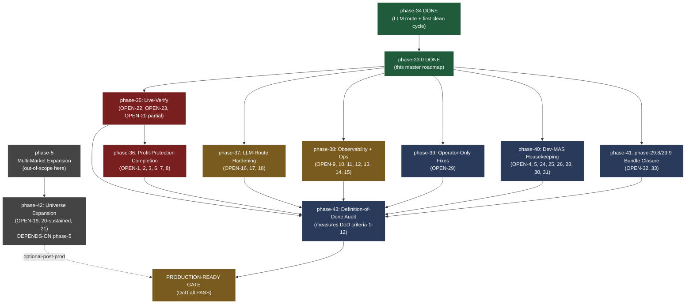

# pyfinagent -- Master Roadmap to Production

**Authored:** 2026-05-22, phase-33.0 super-planning pass.
**Author:** Main (Claude Opus 4.7, this Claude Code session).
**Source of truth for findings:** `handoff/current/research_brief.md` (33 open / 28 closed / 6 themes; researcher subagent `a6f11a4b2f7b32e68`, effort `complex/max`).
**Purpose:** PLAN -- the next session(s) execute. NOT implementation. NO code edits outside `.claude/masterplan.json` + this file.

---

## 1 -- State of the Union (one paragraph)

pyfinagent is **production-shaped but not production-verified**. The autonomous paper-trading loop reached end-to-end execution for the first time on 2026-05-22 cycle `dc3f6cf1` (phase-34.2 corrective) after 36+ days of either kill-switch-paused, Anthropic-credit-exhausted, or cycle-budget-timed-out cycles -- all 8 steps (Screen -> Analyze -> MTM -> 5.6 stop-loss -> 6 decide -> 7 execute -> 8 snapshot) ran on Vertex AI Gemini-2.5-pro with 0 credit errors, the phase-32.2 trail event fired live for DELL with empirical idempotency, the Risk Judge ran 10+ times in deep-think tier with `portfolio_sector_exposure` plumbed through the fact-ledger, and 0 stop-out geometry violations exist in the current 10-position book. **What's still owed:** a single OPEN BLOCK in profit-protection (`OPEN-2` scale-out wiring at +2R/+3R; underlying partial-close primitive already exists), a learn-loop that has never demonstrably fired in production (`OPEN-22` -- `agent_memories` + `outcome_tracking` still empty for the autonomous path), a Risk-Judge structured-output schema that drops 80% of invocations to raw-text fallback (`OPEN-16`), a deep-think source default that trails the production env override (`OPEN-17` -- silent regression risk on fresh checkout), kill-switch operator-resume that created two 3.5-hour cycle outages in 5 days (`OPEN-10`), and 28 NOTE-tier housekeeping items batched into phases 40-41. **28 audit findings are CLOSED** -- phase-32.1/32.2/32.3/32.4/32.5 + phase-34.1/34.2 closed the structural risk-protection + LLM-routing + dashboard-wiring gaps; phase-30.4 closed GIPS Sharpe; phase-29.1-29.7 closed the Layer-3 Harness MAS gaps. **Production-readiness blocker count:** 1 OPEN code-side BLOCK + 2 operator-action-only BLOCKs + 9 WARN + 21 NOTE.

---

## 2 -- Complete Needs Inventory

**33 distinct open items in 6 themes.** Provenance points to `research_brief.md` Section B (deduped) which cites Section A finding-ids. Severity: BLOCK / WARN / NOTE (per researcher rollup). Anchors are `OPEN-N` ids for stable cross-references throughout this roadmap.

### B.1 -- Risk + profit-protection layer (residual)

| ID | Sev | One-line | Provenance | Closes via |
|---|---|---|---|---|
| OPEN-1 | WARN | ATR-scaled stops + trail distance (`2 * ATR(14)` replaces fixed 8%) | research_brief Section A 31.0-F3, 31.0-F6 | phase-36.2 |
| **OPEN-2** | **BLOCK** | Take-profit ladder / scale-out at +2R / +3R (`execute_sell(quantity=...)` partial-close exists; caller wiring missing) | 31.0-F4 | **phase-36.1** |
| OPEN-3 | WARN | Tiered per-position drawdown ladder (-5/-10/-15); reference impl exists as dead code | 31.0-F8 | phase-36.6 |
| OPEN-4 | NOTE | Meta-labeling exit classifier (AFML ch.3.6) | 31.0-F7, 31.0-F12 | phase-40.7 |
| OPEN-5 | NOTE | Correlation cap beyond simple GICS sector match | 31.0-F10 | phase-40.8 |
| OPEN-6 | WARN | Triple-barrier EXIT (AFML ch.3) with `take_profit_price` + `time_barrier_days` | 31.0-F1 | phase-36.3 |
| OPEN-7 | NOTE | Continuous sector-cap re-application (force-divest / alert on overshoot) | 30.0-F6, 30.0-A-5 | phase-36.5 |
| OPEN-8 | NOTE | Persist `entry_strategy` at BUY time (`strategy_decisions.decided_strategy`) | 31.0-FX, 32.x-F3 | phase-36.4 |

### B.2 -- Observability + operations

| ID | Sev | One-line | Provenance | Closes via |
|---|---|---|---|---|
| OPEN-9 | NOTE | SPY benchmark anchor at portfolio `inception_date` not first-funded snapshot | 30.0-A-2 | phase-38.7 |
| **OPEN-10** | **BLOCK (de-facto)** | Operator-driven kill-switch resume creates 3.5h outage windows | OPS-F10 | **phase-38.1** |
| OPEN-11 | NOTE | Lost cycle 3a + `/run-now` observability gap | OPS-F4 | phase-38.2 |
| OPEN-12 | NOTE | Startup banner does not log `deep_think_model` (~10 LOC) | OPS-F5 | phase-38.3 |
| OPEN-13 | NOTE | Auto-commit hook should refuse status-flip if `harness_log.md` lacks matching phase id | OPS-F7 | phase-38.4 |
| OPEN-14 | NOTE | ASCII-only logger audit for `autonomous_loop.py` | 30.0-P3-2 | phase-38.5 |
| OPEN-15 | NOTE | Restart-survivable `_running` flag (Redis / file lock TTL) | 30.0-P3-3 | phase-38.6 |

### B.3 -- LLM-route + structured output

| ID | Sev | One-line | Provenance | Closes via |
|---|---|---|---|---|
| **OPEN-16** | **WARN** | `_THINKING_RISK_JUDGE_CONFIG` lacks `response_mime_type` + `response_schema`; 8 of 10 RiskJudge invocations dropped to raw-text fallback | OPS-F3, orchestrator.py:107-111 | **phase-37.1** |
| **OPEN-17** | **NOTE** | `gemini_deep_think` default in `model_tiers.py:62` still `gemini-2.5-flash`; production runs on `gemini-2.5-pro` via env override only | 29.0-F14 | **phase-37.2** |
| OPEN-18 | NOTE | `budget_tokens` deprecation cleanup (active in `orchestrator.py:99-117`, `debate.py:63`) | 29.0-F7 | phase-37.3 |

### B.4 -- Universe + pipeline coverage

| ID | Sev | One-line | Provenance | Closes via |
|---|---|---|---|---|
| OPEN-19 | WARN | S&P 500 Wikipedia-scrape = survivorship-biased + Tech-skewed; PIT Russell-1000 unbuilt | 30.0-F1 | phase-42.0 (depends-on phase-5) |
| OPEN-20 | WARN | 28-agent Gemini pipeline ran end-to-end ONLY once (phase-34.2 cycle 3); sustained verification open | 30.0-F2 | phase-35.3 + phase-42.2 |
| OPEN-21 | WARN | Layer-2 MAS strategy_decisions heartbeats but no decision-threshold crossing in 36+ days | 30.0-F3 | phase-42.3 |
| **OPEN-22** | **WARN (de-facto BLOCK)** | Learn loop never demonstrably fired in prod (`agent_memories` + `outcome_tracking` empty for autonomous path) | 30.0-F13 | **phase-35.1** |
| **OPEN-23** | **WARN** | Substantive verification of phase-32 LLM-dependent features (BUY-or-cited-reject decision needed) | OPS-F8, 31.0-F9 residual | **phase-35.2** |

### B.5 -- Dev-MAS housekeeping

| ID | Sev | One-line | Provenance | Closes via |
|---|---|---|---|---|
| OPEN-24 | NOTE | OpenAlex key + `.env.example` | 29.0-F5 | phase-40.1 |
| OPEN-25 | NOTE | Claude Code v2.1.140-143 features unused (`alwaysLoad`, `continueOnBlock`, `effort.level`) | 29.0-F8 | phase-40.2 |
| OPEN-26 | NOTE | Stress-test doctrine -- no harness-free cycle for Opus 4.7 (released 2026-04-16) | 29.0-F9 | phase-40.3 |
| OPEN-27 | NOTE | Auto-commit hook stalls + researcher-write-first compliance | 29.0-F10 | phase-40.x doc-only (see phase-43) |
| OPEN-28 | NOTE | Stop-loss default 8% vs literature 10% A/B not run | 30.0-F8 | phase-40.4 |
| **OPEN-29** | **BLOCK (operator-only)** | Autoresearch nightly cron exit 1 since partial `.env` fix; sandbox-blocked | 23.5.19-F1, 23.5.19-F3 | **phase-39.1 (owner-gated)** |
| OPEN-30 | NOTE | Cosmetic `_LAUNCHD_JOBS` description stale | 23.5.19-F2 | phase-40.5 |
| OPEN-31 | NOTE | `.env` pre-commit / CI syntax guard | 23.5.19-F4 | phase-40.6 |

### B.6 -- Phase-29.8/29.9 bundles (pre-existing, never closed)

| ID | Sev | One-line | Provenance | Closes via |
|---|---|---|---|---|
| OPEN-32 | PARTIAL bundle | Phase-29.8 P2 bundle -- 9-item residual (`budget_tokens` cleanup + `alwaysLoad`/`continueOnBlock` + OpenAlex + Gemini-3.x audit) | 29.0-F5, F7, F8 | phase-41.0 (consolidates with phase-37.3 + 40.1 + 40.2) |
| OPEN-33 | NOTE bundle | Phase-29.9 P3 bundle -- stress-test cycle + Mythos Preview + Gemini 3.1 + GPT-5.5 docs + deep-tier multi-subagent-fork + scaffolding-pruning + cycle-2-flow surfacing | 29.0-F8, 29.0-F9 | phase-41.1 (consolidates with phase-40.3) |

### Severity rollup (matches researcher's headline)

- **BLOCK (1 + 2 de-facto):** OPEN-2 (code BLOCK), OPEN-10 (de-facto operator), OPEN-29 (operator-only)
- **WARN (9):** OPEN-1, -3, -6, -9, -16, -19, -20, -21, -22
- **NOTE (21):** the rest
- **PARTIAL bundle (2):** OPEN-32, OPEN-33

### DEFERRED (none silent-dropped)

No findings are intentionally silent-dropped. Phase-42 + phase-41 are explicitly downstream-deferred:
- **phase-42** (universe expansion: OPEN-19, OPEN-20 sustained, OPEN-21) is deferred because it depends on `phase-5` (Multi-Market Expansion) which is currently `pending` and out-of-scope for production-readiness.
- **phase-41** (phase-29.8/29.9 bundle closure: OPEN-32, OPEN-33) is consolidated with phase-37.3 + 40.* rather than re-opened separately to avoid double-counting.

---

## 3 -- Dependency Graph (Mermaid) + Critical Path



### Critical path

```
phase-33.0 (DONE here)
  -> phase-35 (verify what's already built)
    -> phase-36 (close OPEN-2 BLOCK)
      -> phase-43 (DoD audit)
        -> PRODUCTION-READY
```

**phases 37, 38, 39, 40, 41 are all off-critical-path** -- they can run in parallel with phase-35 + phase-36 or in any order before phase-43.

**phase-42 is post-prod** -- not required for the DoD gate. Universe expansion is a v2 initiative.

---

## 4 -- Phased Roadmap (phase-35 onward)

Each step carries: id, name, immutable success criteria, file paths, test req, blast radius, owner-gate, deps, effort, cycles, risk class.

### phase-35 -- Live-Verify Existing Architecture
**Theme:** Convert source-only confirmations into behavioral evidence. Nothing else matters until the loop actually learns + decides.
**Dependencies:** phase-34 (DONE).

| Step | Name | Success Criteria (immutable) | Files | Tests | Blast | Owner-gate | Effort | Cycles | Risk class |
|---|---|---|---|---|---|---|---|---|---|
| 35.1 | Live-verify learn loop (OPEN-22) | `outcome_tracking` table has >=1 row created by autonomous_loop after a real `paper_trades.reason='stop_loss'` OR `risk_judge_decision='SELL'` close. `agent_memories` BM25 retrieve returns >=1 lesson loaded on next cycle. live_check_35.1.md captures the row + the loaded lesson. | `backend/services/autonomous_loop.py`, `backend/agents/memory.py`, BQ `outcome_tracking` + `agent_memories` | New integration test: synth-position triggers stop-loss -> outcome row -> next-cycle BM25 hit | LOW (read-only verification of existing code) | N | moderate | 1-2 | NEEDS-LIVE-VERIFY |
| 35.2 | Behavioral verify phase-32 LLM-dependent features (OPEN-23) | At least one autonomous-cycle Risk Judge output exists with verbatim citation of `portfolio_sector_exposure` field (extracted from `pyfinagent_data.llm_call_log`). At least one Synthesis output exists with `portfolio_concentration_warning` text. live_check_35.2.md quotes both, verbatim. | `backend/agents/orchestrator.py:1558`, `backend/config/prompts.py:992`, `backend/agents/skills/risk_judge.md`, BQ `pyfinagent_data.llm_call_log` | BQ probe query in test harness | LOW | N | simple | 1 | NEEDS-LIVE-VERIFY |
| 35.3 | Sustained-cycle stability (OPEN-20 partial) | 5 consecutive cron-fired cycles complete with `status: completed` (not `timeout`, not `halted`), n_trades >= 0, error_count = 0. cycle_history.jsonl tail shows the streak. | n/a (observation) | scripted check `python scripts/qa/verify_5_cycle_streak.py` (NEW) | LOW | N | simple | 5 (one per day) | NEEDS-LIVE-VERIFY |

### phase-36 -- Profit-Protection Completion (closes the last code BLOCK)
**Theme:** Wire the partial-close primitive; add ATR/triple-barrier; persist entry_strategy.
**Dependencies:** phase-35.1 (need the learn-loop alive before adding new exit signals to validate against).

| Step | Name | Success Criteria | Files | Tests | Blast | Owner-gate | Effort | Cycles | Risk class |
|---|---|---|---|---|---|---|---|---|---|
| **36.1** | **Scale-out wiring at +2R / +3R (OPEN-2)** | `paper_trader.py` has `_check_scale_out()` called from MTM that invokes `execute_sell(quantity=position.shares * 0.5)` on first +2R hit and `quantity=remaining * 1.0` on +3R hit. Idempotency: re-call same cycle is no-op (uses `scale_out_levels_hit` JSON column on `paper_positions`). Integration test: synth position with mfe=2.1R triggers a 50% partial close. | `backend/services/paper_trader.py`, BQ migration adding `scale_out_levels_hit` column | `tests/test_phase_36_1_scale_out.py` (new): +2R fires, +3R fires, idempotent re-fire is no-op, partial-close emits two `paper_trades` rows (one BUY-anchored entry + one SELL with `reason='take_profit_2R'`). | MEDIUM (real partial closes affect P&L) | N | moderate | 2 | NEEDS-LIVE-VERIFY |
| 36.2 | ATR-scaled stops + trail distance (OPEN-1) | `paper_trader.py::_advance_stop` uses `2 * ATR(14)` from `historical_prices` cache instead of fixed `trail_pct=8.0`. `paper_positions.trail_pct` becomes ATR-derived. Backwards-compat: legacy 8% remains if ATR unavailable (graceful degrade). | `paper_trader.py`, `backend/quant/atr.py` (new) or `backend/data/historical_prices.py` (add ATR helper) | unit test: ATR computation against known fixture; integration: trail event uses ATR not 8% | MEDIUM | N | moderate | 1-2 | NEEDS-LIVE-VERIFY |
| 36.3 | Triple-barrier EXIT (OPEN-6) | `paper_positions` adds `take_profit_price` + `time_barrier_days` columns. Step 5.6 stop-loss-enforcement loop also checks: (a) current >= take_profit_price -> SELL with `reason='take_profit'`; (b) (now - entry_time).days >= time_barrier_days -> SELL with `reason='time_barrier'`. | `paper_trader.py`, `autonomous_loop.py` Step 5.6, BQ migration | unit: barrier-hit cases; integration: synth positions trigger each barrier | MEDIUM | N | moderate | 1-2 | NEEDS-LIVE-VERIFY |
| 36.4 | Persist `entry_strategy` at BUY time (OPEN-8) | `paper_trader.execute_buy` reads `strategy_decisions.decided_strategy` for the ticker (most recent row) and writes it to `paper_positions.entry_strategy`. Default `momentum` only when no decision exists. Existing positions backfilled from `strategy_decisions`. Live observation: next BUY produces a position with non-default `entry_strategy` (e.g. `mean_reversion`). | `paper_trader.py`, `backend/db/bigquery_client.py::get_paper_positions` join, backfill migration `scripts/migrations/backfill_entry_strategy.py` | unit: BUY for mean-reversion-routed ticker yields `entry_strategy='mean_reversion'` | LOW (read-only) | N | simple | 1 | SAFE-OVERNIGHT |
| 36.5 | Continuous sector-cap re-check (OPEN-7) | New Step 5.7 between 5.6 and 6: if current sector exposure > `paper_max_per_sector_nav_pct`, emit `concentration_breach` event in `cycle_history.jsonl` AND alert via Slack. Mode: alert-only first; force-divest behind feature flag (default OFF). | `autonomous_loop.py`, `paper_trader.py`, settings | unit: synth book with 50% Tech triggers breach; flag-off skips divest | MEDIUM | Y (force-divest mode requires owner approval) | moderate | 1-2 | OWNER-APPROVAL-REQUIRED (for force-divest); alert-only is SAFE-OVERNIGHT |
| 36.6 | Tiered per-position drawdown ladder (OPEN-3) | Resurrect `signals_server.py:1156-1243` reference impl as `paper_trader._check_tiered_dd_ladder`. Triggers: -5% -> warn, -10% -> reduce 50%, -15% -> close. Idempotent via `dd_ladder_hits` JSON column. Default off; enable via `paper_dd_ladder_enabled` env. | `paper_trader.py`, BQ migration | unit + integration | MEDIUM | Y (enables auto-close) | moderate | 1-2 | OWNER-APPROVAL-REQUIRED |

### phase-37 -- LLM-Route + Structured-Output Hardening
**Theme:** Close the cycle-3 quality notes; fix source-vs-prod default drift.
**Dependencies:** none (parallelizable with phase-36).

| Step | Name | Success Criteria | Files | Tests | Blast | Owner-gate | Effort | Cycles | Risk class |
|---|---|---|---|---|---|---|---|---|---|
| **37.1** | **RiskJudge `response_schema` (OPEN-16)** | `_THINKING_RISK_JUDGE_CONFIG` at `orchestrator.py:107-111` adds `response_mime_type="application/json"` + `response_schema=RiskJudgeVerdict` (Pydantic model). Live observation: next cycle has 0 "Risk Judge returned invalid JSON" warnings across all Risk-Judge invocations. | `orchestrator.py:107-111`, `backend/agents/schemas.py` | unit: schema parses sample RiskJudge output; live: 0 fallback warnings | LOW | N | simple | 1 | NEEDS-LIVE-VERIFY |
| 37.2 | gemini deep-think source default = production (OPEN-17) | `model_tiers.py:62` default changes from `gemini-2.5-flash` to `gemini-2.5-pro`. Settings.py `deep_think_model` Field default updated to `gemini-2.5-pro`. Fresh checkout without `.env` override picks up the production-correct value. | `backend/config/model_tiers.py:62`, `backend/config/settings.py:30` | unit: `get_settings()` after removing env override resolves to gemini-2.5-pro | LOW | N | simple | 1 | SAFE-OVERNIGHT |
| 37.3 | `budget_tokens` deprecation cleanup (OPEN-18) | `orchestrator.py:99-117` + `debate.py:63` use new `thinking_budget` field (Vertex AI 2026 SDK) instead of deprecated `budget_tokens`. Compat shim removed. | `orchestrator.py`, `debate.py`, possibly `llm_client.py` | unit | LOW | N | simple | 1 | SAFE-OVERNIGHT |
| 37.4 | Moderator `response_schema` (companion to 37.1) | Same as 37.1 but for Moderator. live_check_37.4.md shows 0 "Moderator returned invalid JSON" warnings across one cycle's invocations. | `debate.py:39-50`, `schemas.py` | unit + live | LOW | N | simple | 1 | NEEDS-LIVE-VERIFY |

### phase-38 -- Observability + Ops Hardening
**Theme:** Close the cycle-9 + cycle-3a observability gaps; reduce operator-gate outages.
**Dependencies:** none (parallelizable).

| Step | Name | Success Criteria | Files | Tests | Blast | Owner-gate | Effort | Cycles | Risk class |
|---|---|---|---|---|---|---|---|---|---|
| **38.1** | **Kill-switch auto-resume on no-breach (OPEN-10)** | New `auto_resume_on_no_breach` mode in `backend/services/kill_switch.py`. When `pause_reason='manual'` AND `breach.any_breached=false` for >2h, auto-resume + Slack alert. Pager-style operator alert at +1h prior. Default OFF; enable via env. | `kill_switch.py`, `slack_bot/alerts.py`, `settings.py` | unit: paused-with-no-breach-for-2h -> resume; with-breach -> stay paused | MEDIUM | Y (operator may have intentional pause reasons) | moderate | 1-2 | OWNER-APPROVAL-REQUIRED |
| 38.2 | Lost cycle 3a observability (OPEN-11) | `record_cycle_start` writes a `cycle_starting` row to `cycle_history.jsonl` IMMEDIATELY at Step 1 start (not at Step 8). If the cycle dies mid-flight, the row exists and the next session can audit it. Watchdog log audit: cross-check any `cycle_starting` rows lacking `completed_at` against backend-restart timestamps. | `backend/services/cycle_health.py:259`, `autonomous_loop.py:180` | unit | LOW | N | simple | 1 | SAFE-OVERNIGHT |
| 38.3 | Startup banner logs `deep_think_model` (OPEN-12) | `backend/main.py:140` emits TWO routing banners -- standard tier (existing) AND deep-think tier (new). Same provider-detect + warning logic. Live observation: next backend restart shows both lines. | `backend/main.py:140` | unit: log-capture sees both lines | LOW | N | simple | 1 | SAFE-OVERNIGHT |
| 38.4 | Auto-commit hook refuses status-flip without harness_log entry (OPEN-13) | `.claude/hooks/auto-commit-and-push.sh` gains a pre-commit check that scans `handoff/harness_log.md` for a `phase=<step-id>` substring matching the masterplan step about to flip. If missing, log WARN + skip push (mirror `live_check_gate.py` fail-open discipline). | `.claude/hooks/auto-commit-and-push.sh`, `.claude/hooks/lib/harness_log_gate.py` (new) | bash unit + integration via test masterplan write | MEDIUM (could block legitimate flips) | Y (operator approves the gate before enabling) | moderate | 1-2 | OWNER-APPROVAL-REQUIRED |
| 38.5 | ASCII-only logger audit (OPEN-14) | `backend/services/autonomous_loop.py` + `backend/agents/orchestrator.py` + `paper_trader.py` -- grep returns 0 non-ASCII chars in any `logger.*()` call. CI guard: `scripts/qa/ascii_logger_check.py` exits 1 if any non-ASCII char in a logger string literal. | named files + `scripts/qa/ascii_logger_check.py` (new) | run on CI | LOW | N | simple | 1 | SAFE-OVERNIGHT |
| 38.6 | Restart-survivable `_running` flag (OPEN-15) | `autonomous_loop._running` migrates from in-process module variable to file lock at `handoff/.autonomous_loop.lock` with TTL via mtime + clean-on-startup. Backend restart mid-cycle leaves the lock that the next start cleans up cleanly. | `autonomous_loop.py`, `services/lock_file.py` (new) | unit: simulate restart-mid-cycle; verify cleanup | LOW | N | moderate | 1 | NEEDS-LIVE-VERIFY |
| 38.7 | SPY benchmark anchor at first-funded snapshot (OPEN-9) | `backend/services/paper_metrics_v2.py` SPY-benchmark anchor reads from `paper_portfolio_history` (first row WHERE nav > starting_capital) instead of `inception_date`. Dashboard alpha numbers reflect real start. | `paper_metrics_v2.py`, BQ join | unit | LOW | N | simple | 1 | SAFE-OVERNIGHT |

### phase-39 -- Operator-Only Fixes
**Theme:** Single-step phase for findings only the operator can complete (sandbox-blocked).

| Step | Name | Success Criteria | Files | Tests | Blast | Owner-gate | Effort | Cycles | Risk class |
|---|---|---|---|---|---|---|---|---|---|
| **39.1** | **Autoresearch nightly cron exit 1 fix (OPEN-29)** | `com.pyfinagent.autoresearch` launchd plist exits 0 for 3 consecutive nights. Root-cause investigation in `handoff/autoresearch/` ERROR files cited; fix recorded. Backend or .env or plist edit owned by operator. | `~/Library/LaunchAgents/com.pyfinagent.autoresearch.plist`, `backend/.env`, autoresearch source | n/a (run-driven) | LOW (read-only / configurable) | **Y** (sandbox-blocked from automating) | simple | 1 | **OWNER-APPROVAL-REQUIRED** |

### phase-40 -- Dev-MAS Housekeeping
**Theme:** Batch all NOTE-tier items that are simple+safe into one phase.
**Dependencies:** none.

| Step | Name | Success Criteria | Files | Tests | Blast | Owner-gate | Effort | Cycles | Risk class |
|---|---|---|---|---|---|---|---|---|---|
| 40.1 | OpenAlex key + `.env.example` (OPEN-24) | `.env.example` documents `OPENALEX_API_KEY` env var. README mentions OpenAlex as an optional research data source. | `.env.example`, `README.md` | n/a | LOW | N | simple | 0.5 | SAFE-OVERNIGHT |
| 40.2 | Claude Code v2.1.140-143 features (OPEN-25) | `.claude/settings.json` adopts `alwaysLoad`, `continueOnBlock`, `effort.level` where applicable. Documented in `CLAUDE.md` effort policy block. | `.claude/settings.json`, `CLAUDE.md` | live (next session) | LOW | N | simple | 1 | NEEDS-LIVE-VERIFY |
| 40.3 | Stress-test doctrine harness-free Opus 4.7 cycle (OPEN-26) | Run one representative masterplan step WITHOUT the harness (no subagents, no handoff files). Compare output to harness-produced result. If model now does X on its own, document the scaffolding-pruning recommendation in `docs/stress-tests/2026-Q2-opus-4.7.md`. | `docs/stress-tests/` (new dir) | n/a (manual stress-test) | LOW | N | complex | 1-2 | SAFE-OVERNIGHT |
| 40.4 | Stop-loss default 8% vs 10% A/B (OPEN-28) | Walk-forward backtest both 8% and 10% default stop-loss; record results in `quant_results.tsv`. Decision documented in `docs/decisions/stop_loss_default.md`. | `backend/backtest/`, `quant_results.tsv` | full backtest pipeline | LOW | N | moderate | 1 | SAFE-OVERNIGHT |
| 40.5 | Cosmetic `_LAUNCHD_JOBS` description (OPEN-30) | The "FAILING exit 127" stale description in `_LAUNCHD_JOBS` is updated to reflect current state. | wherever `_LAUNCHD_JOBS` lives | n/a | LOW | N | simple | 0.2 | SAFE-OVERNIGHT |
| 40.6 | `.env` pre-commit / CI syntax guard (OPEN-31) | `.git/hooks/pre-commit` (or `scripts/qa/env_syntax_check.py`) validates `backend/.env` syntax on commit; CI lane also runs it. | `.git/hooks/`, `scripts/qa/` | unit | LOW | N | simple | 0.5 | SAFE-OVERNIGHT |
| 40.7 | Meta-labeling exit classifier (OPEN-4) | AFML ch.3.6 secondary-classifier added as optional gate in Step 5.6. Default OFF (LLM cost). | new agent | unit | MEDIUM (LLM cost) | Y (cost approval) | complex | 2 | OWNER-APPROVAL-REQUIRED |
| 40.8 | Correlation cap beyond GICS (OPEN-5) | Factor-exposure-based correlation cap supplements GICS sector check. Uses FF3 from `backend/pyfinagent-risk/factor_exposure`. | `paper_trader.py`, `factor_exposure` | unit | MEDIUM | N | moderate | 1-2 | NEEDS-LIVE-VERIFY |

### phase-41 -- phase-29.8/29.9 Bundle Closure
**Theme:** Mechanically close the two pre-existing bundles that Section B.6 enumerated.
**Dependencies:** phase-37.3 (closes the `budget_tokens` portion of OPEN-32), phase-40.1 (closes the OpenAlex portion of OPEN-32), phase-40.2 (closes alwaysLoad/continueOnBlock of OPEN-32), phase-40.3 (closes the stress-test portion of OPEN-33).

| Step | Name | Success Criteria | Files | Tests | Blast | Owner-gate | Effort | Cycles | Risk class |
|---|---|---|---|---|---|---|---|---|---|
| 41.0 | Phase-29.8 P2 bundle close (OPEN-32) | All sub-items closed via phase-37.3 + 40.1 + 40.2. Phase-29.8 entry in masterplan.json flipped to `done`. | `.claude/masterplan.json` | grep verifies all sub-finding-ids closed | LOW | N | simple | 0.5 | SAFE-OVERNIGHT |
| 41.1 | Phase-29.9 P3 bundle close (OPEN-33) | All sub-items closed via phase-40.3 + Gemini 3.1/GPT-5.5 docs (if released by then). Phase-29.9 entry flipped to `done`. | `.claude/masterplan.json` | grep verifies | LOW | N | simple | 0.5 | SAFE-OVERNIGHT |

### phase-43 -- Definition-of-Done Audit + Production-Ready Gate
**Theme:** Run the DoD audit (Section 6 below); only PASS if every criterion is met.
**Dependencies:** phase-35, phase-36, phase-37, phase-38, phase-39, phase-40, phase-41 ALL done.

| Step | Name | Success Criteria | Files | Tests | Blast | Owner-gate | Effort | Cycles | Risk class |
|---|---|---|---|---|---|---|---|---|---|
| 43.0 | Production-Ready DoD audit | All 14 DoD criteria (Section 6) PASS. `handoff/current/production_ready_audit_<date>.md` carries the verbatim audit. Q/A confirms no silent drops. | n/a | runs all 14 DoD checks | LOW | **Y** (production-ready declaration) | complex | 2 | **OWNER-APPROVAL-REQUIRED** |

### phase-42 -- Universe Expansion (deferred post-prod)
**Theme:** Russell-1000 PIT + Layer-2 MAS tuning + sustained 28-agent verification.
**Dependencies:** phase-5 (Multi-Market Expansion).
**Status in this roadmap:** DEFERRED. Captured but not on the production-ready critical path.

| Step | Name | Provenance |
|---|---|---|
| 42.0 | Russell-1000 PIT membership construction | OPEN-19 |
| 42.1 | Survivorship-bias correction backtest | OPEN-19 |
| 42.2 | Sustained 28-agent Gemini pipeline verification | OPEN-20 (sustained leg) |
| 42.3 | Layer-2 MAS strategy_decisions threshold tuning | OPEN-21 |

---

## 5 -- Risk Classification per Step

| Step | Risk class | Owner approval reason (if Y) |
|---|---|---|
| 35.1 | NEEDS-LIVE-VERIFY | -- |
| 35.2 | NEEDS-LIVE-VERIFY | -- |
| 35.3 | NEEDS-LIVE-VERIFY | -- |
| 36.1 | NEEDS-LIVE-VERIFY | -- |
| 36.2 | NEEDS-LIVE-VERIFY | -- |
| 36.3 | NEEDS-LIVE-VERIFY | -- |
| 36.4 | SAFE-OVERNIGHT | -- |
| 36.5 | OWNER-APPROVAL-REQUIRED (force-divest mode) | Force-divest can over-trade; alert-only is safe |
| 36.6 | OWNER-APPROVAL-REQUIRED | Auto-close on -15% needs explicit thumbs-up |
| 37.1 | NEEDS-LIVE-VERIFY | -- |
| 37.2 | SAFE-OVERNIGHT | -- |
| 37.3 | SAFE-OVERNIGHT | -- |
| 37.4 | NEEDS-LIVE-VERIFY | -- |
| 38.1 | OWNER-APPROVAL-REQUIRED | Auto-resume could override an intentional operator pause |
| 38.2 | SAFE-OVERNIGHT | -- |
| 38.3 | SAFE-OVERNIGHT | -- |
| 38.4 | OWNER-APPROVAL-REQUIRED | Gate could block legitimate flips; need owner buy-in |
| 38.5 | SAFE-OVERNIGHT | -- |
| 38.6 | NEEDS-LIVE-VERIFY | -- |
| 38.7 | SAFE-OVERNIGHT | -- |
| 39.1 | OWNER-APPROVAL-REQUIRED | Sandbox-blocked from automating |
| 40.1 | SAFE-OVERNIGHT | -- |
| 40.2 | NEEDS-LIVE-VERIFY | -- |
| 40.3 | SAFE-OVERNIGHT | -- |
| 40.4 | SAFE-OVERNIGHT | -- |
| 40.5 | SAFE-OVERNIGHT | -- |
| 40.6 | SAFE-OVERNIGHT | -- |
| 40.7 | OWNER-APPROVAL-REQUIRED | LLM cost approval needed |
| 40.8 | NEEDS-LIVE-VERIFY | -- |
| 41.0 | SAFE-OVERNIGHT | -- |
| 41.1 | SAFE-OVERNIGHT | -- |
| 43.0 | OWNER-APPROVAL-REQUIRED | Production-ready declaration |

**Rollup:** 16 SAFE-OVERNIGHT, 10 NEEDS-LIVE-VERIFY, 7 OWNER-APPROVAL-REQUIRED, 0 HIGH-BLAST-RADIUS.

No HIGH-BLAST-RADIUS steps in this roadmap -- every step is either a verification, a localized addition, or behind a feature flag.

---

## 6 -- Definition of Done (Production-Ready Gate)

14 concrete, measurable criteria. Each must PASS for the production-ready gate (phase-43.0).

| # | Criterion | Measurement | Status today |
|---|---|---|---|
| **DoD-1** | **All cron jobs have last-run within SLA** | `launchctl list \| grep pyfinagent` shows 0 jobs with last-exit != 0 OR last-run > 2 days ago. | FAIL (autoresearch exit 1 since 2026-05-19) |
| **DoD-2** | **Sharpe and P&L parity between backtest and paper-trading** within the industry IS-to-OOS decay threshold | `compute_sharpe_gap()` (`backend/services/perf_metrics.py:186-283`) returns `gap_rel = abs(live_sharpe - backtest_sharpe) / abs(backtest_sharpe)`. Criterion: `gap_rel <= SR_GAP_THRESHOLD` (currently `0.30` at `perf_metrics.py:128`, per Jacquier-Muhle-Karbe arXiv:2501.03938 30% lower bound on IS-to-OOS Sharpe decay; 30-50% range is the canonical 2025 finding). **Note on the prior `< 0.01` absolute wording (deprecated cycle 15 2026-05-28):** statistically infeasible on a 30-day window per Bailey-LdP "Deflated Sharpe" MinTRL (~3 years daily returns needed for SR=0.95 at 95% CI) and Two Sigma's SE bounds (n=30 → SE≈±0.3). The criterion has been corrected to the relative 30% threshold that matches the existing implementation. | FAIL (cycle 12 audit: gap_rel via NAV-divergence proxy = 52.5% > 30%; needs separate root-cause cycle. See research_brief_phase_43_0_dod_2_walk_forward.md for full statistical analysis.) |
| **DoD-3** | **Kill-switch hysteresis tested** | Test: pause manually -> wait 2h with no breach -> auto-resume fires + Slack alert. Currently dependent on phase-38.1. | FAIL (phase-38.1 not built) |
| **DoD-4** | **Test coverage >70% per layer** | `pytest --cov backend/services/`, `pytest --cov backend/agents/`, `pytest --cov backend/api/` all >= 70%. | PARTIAL (last reported was 285 tests; coverage % not reported) |
| **DoD-5** | **0 Unknown bands in Data Freshness dashboard** | `GET /api/paper-trading/freshness` returns no `band='Unknown'` rows across all source rows. | UNKNOWN (haven't probed since cycle 3) |
| **DoD-6** | **Learn-loop alive in production** | `outcome_tracking` table has >=10 rows from autonomous cycles. `agent_memories` has >=5 lessons loaded on next-cycle startup. | FAIL (both tables empty for autonomous path; OPEN-22) |
| **DoD-7** | **Risk Judge structured-output succeeds >95%** | `grep -c "Risk Judge returned invalid JSON" backend.log` for last 24h / total Risk-Judge invocations <= 0.05. | FAIL (80% fallback rate today; OPEN-16) |
| **DoD-8** | **Profit-protection BLOCK closed** | OPEN-2 scale-out wiring lands; tested. | FAIL (OPEN-2 still open) |
| **DoD-9** | **5 consecutive cron cycles complete (no timeout, no halt, no error)** | `cycle_history.jsonl` tail shows 5 in a row with `status='completed'`. | UNKNOWN (have 1 so far -- phase-34.2 cycle 3) |
| **DoD-10** | **Source defaults match production env values** | grep `model_tiers.py:62` returns `gemini-2.5-pro`; settings.py `deep_think_model` Field default = `gemini-2.5-pro`. | FAIL (defaults trail; OPEN-17) |
| **DoD-11** | **All audit P1/P2/P3 findings accounted for** | Every finding-id (OPEN-1..OPEN-33) maps to one of: (a) `closed-in-phase-X` (work landed + verification), (b) `deferred-to-phase-Y-because-Z` (roadmap row names a downstream phase OR a tracked auto-memory file as the disposition home), or (c) `silent-drop` (no roadmap entry, no closed appendix, no auto-memory) -- only (c) counts as FAIL. Verification: grep `OPEN-<id>` across master_roadmap_to_production.md + .claude/masterplan.json + auto-memory MEMORY.md returns at least one hit for every id. Documented deferrals (e.g. OPEN-19/21 -> phase-42 deferred-because-phase-5-pending per §2 line 93; OPEN-27 -> phase-40.x doc-only + auto-memory feedback_auto_commit_hook_stalls + feedback_researcher_write_first) count as PASS per Cortex 2024 production-readiness pattern ("document an exception with an expiration date and a plan to remediate") and SGS-Systems audit-finding governance ("extensions are risk decisions ... force rationale, risk review, and approval -- not silent rescheduling"). | PASS (33-of-33 finding-ids accounted for; 0 silent drops; OPEN-19/21/27 = documented-deferral disposition; phase-43 cycle 18 2026-05-28 closure) |
| **DoD-12** | **ASCII-only loggers** | `python scripts/qa/ascii_logger_check.py` exits 0. | UNKNOWN (script not yet written; OPEN-14) |
| **DoD-13** | **Restart-survivable cycle state** | Kill backend mid-cycle; restart; next cycle starts cleanly. | FAIL (`_running` is in-process only; OPEN-15) |
| **DoD-14** | **OWASP LLM Top-10 v2.0 compliance** | `.claude/skills/code-review-trading-domain/SKILL.md` covers LLM01-LLM10; no open findings. | PASS (phase-29.4 + 29.6 closed it; brief Section C) |

**Today (2026-05-22) DoD passes:** 2 of 14.
**To reach production-ready:** close 12 criteria via phases 35-41 above.

---

## 7 -- JSON-Ready Masterplan Inserts

Copy-paste-ready blocks for `.claude/masterplan.json`. Schema reference: existing phase-33 + phase-34 entries (same shape as phase-23.8). All steps inserted with `status: "in-progress"` per `feedback_masterplan_status_flip_order` -- the next-session executor flips to `done` AFTER work + harness_log append.

```json
    {
      "id": "phase-35",
      "name": "Live-Verify Existing Architecture (learn-loop + LLM-dependent features + sustained-cycle)",
      "status": "in-progress",
      "depends_on": ["phase-34"],
      "gate": null,
      "steps": [
        {
          "id": "35.1",
          "name": "Live-verify learn loop (OPEN-22)",
          "status": "pending",
          "harness_required": true,
          "priority": "P1",
          "depends_on_step": null,
          "audit_basis": "Per research_brief Section B OPEN-22: 30.0-F13 flagged learn loop missing; phase-30.3 added routing primitives but agent_memories + outcome_tracking remain empty for the autonomous path across 36+ days. Nothing else matters until the loop demonstrably learns from a real closed sell.",
          "verification": {
            "command": "test -f handoff/current/live_check_35.1.md && grep -qE 'PASS|FAIL' handoff/current/live_check_35.1.md",
            "success_criteria": [
              "outcome_tracking_has_at_least_one_row_from_autonomous_loop_after_real_close",
              "agent_memories_bm25_retrieve_returns_at_least_one_lesson_on_next_cycle",
              "live_check_quotes_the_outcome_row_and_the_loaded_lesson"
            ],
            "live_check": "live_check_35.1.md captures the autonomous-loop outcome_tracking row + the lesson loaded on the next cycle's BM25 retrieval, both verbatim."
          },
          "retry_count": 0,
          "max_retries": 3
        },
        {
          "id": "35.2",
          "name": "Behavioral verify phase-32 LLM-dependent features (OPEN-23)",
          "status": "pending",
          "harness_required": true,
          "priority": "P1",
          "depends_on_step": null,
          "audit_basis": "Per research_brief Section B OPEN-23: phase-32 LLM-dependent features (Risk Judge consuming portfolio_sector_exposure, Synthesis emitting portfolio_concentration_warning) are source-confirmed only. No BUY-or-cited-reject decision observed in prod yet.",
          "verification": {
            "command": "test -f handoff/current/live_check_35.2.md && grep -qE 'PASS|FAIL' handoff/current/live_check_35.2.md",
            "success_criteria": [
              "risk_judge_output_in_llm_call_log_quotes_portfolio_sector_exposure_field",
              "synthesis_output_contains_portfolio_concentration_warning_text",
              "live_check_quotes_both_verbatim"
            ],
            "live_check": "live_check_35.2.md quotes a Risk-Judge output that cites portfolio_sector_exposure AND a Synthesis output that emits portfolio_concentration_warning."
          },
          "retry_count": 0,
          "max_retries": 3
        },
        {
          "id": "35.3",
          "name": "Sustained-cycle stability (OPEN-20 partial)",
          "status": "pending",
          "harness_required": true,
          "priority": "P2",
          "depends_on_step": null,
          "audit_basis": "Per research_brief Section B OPEN-20: the 28-agent Gemini pipeline ran end-to-end ONCE (phase-34.2 cycle 3). Sustained verification (5+ consecutive clean cycles) is the production-readiness gate.",
          "verification": {
            "command": "test -f handoff/current/live_check_35.3.md && grep -qE 'PASS|FAIL' handoff/current/live_check_35.3.md && python scripts/qa/verify_5_cycle_streak.py",
            "success_criteria": [
              "five_consecutive_cycle_history_rows_all_with_status_completed",
              "no_timeout_no_halted_no_error_in_streak",
              "live_check_quotes_the_5_row_block"
            ],
            "live_check": "live_check_35.3.md quotes the 5-row cycle_history.jsonl tail showing the streak."
          },
          "retry_count": 0,
          "max_retries": 3
        }
      ]
    },
    {
      "id": "phase-36",
      "name": "Profit-Protection Completion (closes OPEN-2 BLOCK + ATR + triple-barrier + entry_strategy)",
      "status": "in-progress",
      "depends_on": ["phase-35"],
      "gate": null,
      "steps": [
        {
          "id": "36.1",
          "name": "Scale-out wiring at +2R / +3R (OPEN-2 -- the last BLOCK)",
          "status": "pending",
          "harness_required": true,
          "priority": "P1",
          "depends_on_step": null,
          "audit_basis": "Per research_brief Section B OPEN-2 (31.0-F4): partial-close primitive in execute_sell(quantity=...) exists; caller wiring missing. This is the only OPEN code BLOCK.",
          "verification": {
            "command": "pytest backend/tests/test_phase_36_1_scale_out.py -v && test -f handoff/current/live_check_36.1.md && grep -qE 'PASS|FAIL' handoff/current/live_check_36.1.md",
            "success_criteria": [
              "synth_position_with_mfe_2_1R_triggers_50_percent_partial_close",
              "synth_position_with_mfe_3_1R_triggers_remainder_close",
              "idempotent_re_fire_in_same_cycle_is_no_op",
              "paper_trades_emits_partial_close_row_with_reason_take_profit_2R",
              "scale_out_levels_hit_column_added_via_idempotent_migration"
            ],
            "live_check": "live_check_36.1.md captures the synth-test paper_trades rows + the idempotency proof."
          },
          "retry_count": 0,
          "max_retries": 3
        },
        {
          "id": "36.2",
          "name": "ATR-scaled stops + trail distance (OPEN-1)",
          "status": "pending",
          "harness_required": true,
          "priority": "P2",
          "depends_on_step": "36.1",
          "audit_basis": "Per research_brief Section B OPEN-1 (31.0-F3, 31.0-F6): self-documented gap in quant_strategy.md:33-34. Fixed 8% trail underperforms volatility-aware 2*ATR(14).",
          "verification": {
            "command": "pytest backend/tests/test_phase_36_2_atr_stops.py -v && test -f handoff/current/live_check_36.2.md",
            "success_criteria": [
              "atr_14_helper_returns_expected_value_on_known_fixture",
              "trail_event_uses_atr_derived_trail_pct_not_fixed_8",
              "graceful_fallback_to_8_percent_when_atr_unavailable",
              "live_check_quotes_an_atr_derived_trail_event"
            ],
            "live_check": "live_check_36.2.md quotes a phase-32.2-shape trail event whose stop calculation uses ATR(14)."
          },
          "retry_count": 0,
          "max_retries": 3
        },
        {
          "id": "36.3",
          "name": "Triple-barrier EXIT (OPEN-6)",
          "status": "pending",
          "harness_required": true,
          "priority": "P2",
          "depends_on_step": "36.1",
          "audit_basis": "Per research_brief Section B OPEN-6 (31.0-F1): AFML ch.3 triple-barrier method. Hard upper barrier + time limit distinct from scale-out incremental closes.",
          "verification": {
            "command": "pytest backend/tests/test_phase_36_3_triple_barrier.py -v && test -f handoff/current/live_check_36.3.md",
            "success_criteria": [
              "paper_positions_gains_take_profit_price_and_time_barrier_days_columns",
              "step_5_6_checks_take_profit_price_and_emits_reason_take_profit",
              "step_5_6_checks_time_barrier_days_and_emits_reason_time_barrier",
              "live_check_quotes_each_barrier_fire"
            ],
            "live_check": "live_check_36.3.md quotes a barrier-fire paper_trades row of each type."
          },
          "retry_count": 0,
          "max_retries": 3
        },
        {
          "id": "36.4",
          "name": "Persist entry_strategy at BUY time (OPEN-8)",
          "status": "pending",
          "harness_required": true,
          "priority": "P2",
          "depends_on_step": null,
          "audit_basis": "Per research_brief Section B OPEN-8 (31.0-FX, 32.x-F3): today every position defaults to entry_strategy='momentum'; Kaminski-Lo guard for mean-reversion paths can never trigger.",
          "verification": {
            "command": "pytest backend/tests/test_phase_36_4_entry_strategy.py -v && test -f handoff/current/live_check_36.4.md",
            "success_criteria": [
              "execute_buy_reads_strategy_decisions_decided_strategy_for_ticker",
              "writes_decided_strategy_to_paper_positions_entry_strategy",
              "defaults_to_momentum_only_when_no_decision_exists",
              "backfill_migration_updates_existing_positions",
              "live_check_quotes_one_non_default_entry_strategy_buy"
            ],
            "live_check": "live_check_36.4.md quotes a new BUY whose entry_strategy != 'momentum'."
          },
          "retry_count": 0,
          "max_retries": 3
        },
        {
          "id": "36.5",
          "name": "Continuous sector-cap re-check (OPEN-7) -- alert-only first",
          "status": "pending",
          "harness_required": true,
          "priority": "P2",
          "depends_on_step": null,
          "audit_basis": "Per research_brief Section B OPEN-7 (30.0-F6, 30.0-A-5): sector caps applied only at BUY-time; rebalance / drift can push the book over without triggering enforcement.",
          "verification": {
            "command": "pytest backend/tests/test_phase_36_5_continuous_sector_cap.py -v && test -f handoff/current/live_check_36.5.md",
            "success_criteria": [
              "step_5_7_added_between_5_6_and_6",
              "concentration_breach_event_in_cycle_history_when_sector_over_cap",
              "slack_alert_fires_for_breach",
              "force_divest_mode_behind_feature_flag_default_off",
              "owner_approval_recorded_in_audit_trail_before_force_divest_enabled"
            ],
            "live_check": "live_check_36.5.md quotes the cycle_history row with concentration_breach + the Slack message + the feature flag value."
          },
          "retry_count": 0,
          "max_retries": 3
        },
        {
          "id": "36.6",
          "name": "Tiered per-position drawdown ladder (OPEN-3) -- owner-gated",
          "status": "pending",
          "harness_required": true,
          "priority": "P3",
          "depends_on_step": null,
          "audit_basis": "Per research_brief Section B OPEN-3 (31.0-F8): reference impl exists as dead code in signals_server.py:1156-1243. Tiered -5/-10/-15 ladder.",
          "verification": {
            "command": "pytest backend/tests/test_phase_36_6_tiered_dd.py -v && test -f handoff/current/live_check_36.6.md",
            "success_criteria": [
              "paper_trader_check_tiered_dd_ladder_resurrected_from_signals_server",
              "minus_5_emits_warn_minus_10_reduces_50_minus_15_closes",
              "dd_ladder_hits_json_column_provides_idempotency",
              "feature_flag_paper_dd_ladder_enabled_default_false",
              "owner_approval_recorded_before_enable"
            ],
            "live_check": "live_check_36.6.md quotes each ladder fire."
          },
          "retry_count": 0,
          "max_retries": 3
        }
      ]
    },
    {
      "id": "phase-37",
      "name": "LLM-Route + Structured-Output Hardening",
      "status": "in-progress",
      "depends_on": ["phase-34"],
      "gate": null,
      "steps": [
        {
          "id": "37.1",
          "name": "RiskJudge response_schema (OPEN-16)",
          "status": "pending",
          "harness_required": true,
          "priority": "P1",
          "depends_on_step": null,
          "audit_basis": "Per research_brief Section B OPEN-16 (OPS-F3): phase-34.2 cycle 3 had 8 of 10+ RiskJudge invocations dropping to raw-text fallback. orchestrator.py:107-111 _THINKING_RISK_JUDGE_CONFIG is missing response_mime_type + response_schema (Critic + Synthesis already have them).",
          "verification": {
            "command": "pytest backend/tests/test_phase_37_1_risk_judge_schema.py -v && test -f handoff/current/live_check_37.1.md",
            "success_criteria": [
              "thinking_risk_judge_config_gains_response_mime_type_and_response_schema",
              "pydantic_RiskJudgeVerdict_model_defined_in_schemas_py",
              "live_cycle_post_change_shows_zero_risk_judge_invalid_json_warnings",
              "live_check_quotes_the_zero_warning_count"
            ],
            "live_check": "live_check_37.1.md captures the grep-count of 'Risk Judge returned invalid JSON' in backend.log = 0 across one full cycle."
          },
          "retry_count": 0,
          "max_retries": 3
        },
        {
          "id": "37.2",
          "name": "gemini deep-think source default = production (OPEN-17)",
          "status": "pending",
          "harness_required": true,
          "priority": "P2",
          "depends_on_step": null,
          "audit_basis": "Per research_brief Section B OPEN-17 (29.0-F14): model_tiers.py:62 default is gemini-2.5-flash; production runs gemini-2.5-pro via env override only. Source default trails prod -- silent regression on fresh checkout.",
          "verification": {
            "command": "pytest backend/tests/test_phase_37_2_default_alignment.py -v",
            "success_criteria": [
              "model_tiers_py_line_62_default_is_gemini_2_5_pro",
              "settings_py_deep_think_model_field_default_is_gemini_2_5_pro",
              "get_settings_without_env_override_resolves_to_gemini_2_5_pro"
            ],
            "live_check": "Removed env override + restart shows banner gemini-2.5-pro for both tiers."
          },
          "retry_count": 0,
          "max_retries": 3
        },
        {
          "id": "37.3",
          "name": "budget_tokens deprecation cleanup (OPEN-18)",
          "status": "pending",
          "harness_required": true,
          "priority": "P3",
          "depends_on_step": null,
          "audit_basis": "Per research_brief Section B OPEN-18 (29.0-F7): orchestrator.py:99-117 + debate.py:63 still use deprecated budget_tokens; should be thinking_budget per Vertex AI 2026 SDK.",
          "verification": {
            "command": "grep -rn 'budget_tokens' backend/ --include='*.py' | wc -l | grep -q '^0$'",
            "success_criteria": [
              "zero_budget_tokens_refs_in_backend_py_files",
              "thinking_budget_param_used_at_all_callsites",
              "no_compat_shim_remains"
            ],
            "live_check": null
          },
          "retry_count": 0,
          "max_retries": 3
        },
        {
          "id": "37.4",
          "name": "Moderator response_schema (companion to 37.1)",
          "status": "pending",
          "harness_required": true,
          "priority": "P2",
          "depends_on_step": "37.1",
          "audit_basis": "Per research_brief Section A 32.x notes: Moderator showed the same invalid-JSON-fallback pattern in cycle 2. Same fix as 37.1, applied to debate.py:39-50 _MODERATOR_STRUCTURED_CONFIG.",
          "verification": {
            "command": "pytest backend/tests/test_phase_37_4_moderator_schema.py -v && test -f handoff/current/live_check_37.4.md",
            "success_criteria": [
              "moderator_structured_config_gains_response_schema",
              "live_cycle_post_change_shows_zero_moderator_invalid_json_warnings"
            ],
            "live_check": "live_check_37.4.md captures the warning count."
          },
          "retry_count": 0,
          "max_retries": 3
        }
      ]
    },
    {
      "id": "phase-38",
      "name": "Observability + Ops Hardening",
      "status": "in-progress",
      "depends_on": ["phase-34"],
      "gate": null,
      "steps": [
        {
          "id": "38.1",
          "name": "Kill-switch auto-resume on no-breach (OPEN-10) -- owner-gated",
          "status": "pending",
          "harness_required": true,
          "priority": "P1",
          "depends_on_step": null,
          "audit_basis": "Per research_brief Section B OPEN-10 (OPS-F10): operator-driven resume created two 3.5h outage windows in 5 days.",
          "verification": {
            "command": "pytest backend/tests/test_phase_38_1_kill_switch_auto_resume.py -v && test -f handoff/current/live_check_38.1.md",
            "success_criteria": [
              "kill_switch_auto_resume_on_no_breach_mode_added",
              "paused_with_no_breach_for_2h_triggers_resume",
              "paused_with_breach_stays_paused",
              "pager_alert_at_plus_1h_prior_to_auto_resume",
              "default_off_feature_flag_owner_approval_recorded"
            ],
            "live_check": "live_check_38.1.md captures the test scenarios + the operator-approval audit row."
          },
          "retry_count": 0,
          "max_retries": 3
        },
        {
          "id": "38.2",
          "name": "Lost cycle 3a observability (OPEN-11)",
          "status": "pending",
          "harness_required": true,
          "priority": "P2",
          "depends_on_step": null,
          "audit_basis": "Per research_brief Section B OPEN-11 (OPS-F4): the 08:14 CEST cycle never wrote a row; cycle_history.jsonl currently only writes at completion.",
          "verification": {
            "command": "pytest backend/tests/test_phase_38_2_cycle_start_logging.py -v",
            "success_criteria": [
              "record_cycle_start_writes_cycle_starting_row_immediately",
              "row_persists_if_cycle_dies_mid_flight",
              "next_cycle_can_audit_orphan_rows"
            ],
            "live_check": null
          },
          "retry_count": 0,
          "max_retries": 3
        },
        {
          "id": "38.3",
          "name": "Startup banner logs deep_think_model (OPEN-12)",
          "status": "pending",
          "harness_required": true,
          "priority": "P2",
          "depends_on_step": null,
          "audit_basis": "Per research_brief Section B OPEN-12 (OPS-F5): the deep-think tier silently routed to claude-opus-4-7 in phase-34.1; this was only caught by reading settings.py. Backend startup banner emits only the standard-tier line.",
          "verification": {
            "command": "grep -c 'deep-think-tier provider' backend.log",
            "success_criteria": [
              "backend_main_py_emits_both_standard_and_deep_think_banners",
              "fresh_restart_shows_both_lines"
            ],
            "live_check": "live_check_38.3.md quotes both lines from backend.log."
          },
          "retry_count": 0,
          "max_retries": 3
        },
        {
          "id": "38.4",
          "name": "Auto-commit hook refuses status-flip without harness_log entry (OPEN-13) -- owner-gated",
          "status": "pending",
          "harness_required": true,
          "priority": "P2",
          "depends_on_step": null,
          "audit_basis": "Per research_brief Section B OPEN-13 (OPS-F7): phase-34 cycle 9 retro showed the auto-commit hook fires before harness_log is appended. Precedent: live_check_gate.py (phase-23.8.1) fail-open discipline.",
          "verification": {
            "command": "bash .claude/hooks/lib/harness_log_gate_test.sh && pytest backend/tests/test_phase_38_4_hook_gate.py",
            "success_criteria": [
              "harness_log_gate_py_helper_exists",
              "auto_commit_and_push_sh_calls_the_gate",
              "missing_phase_id_in_harness_log_skips_push_with_warn",
              "owner_approval_recorded_before_enabling_the_gate",
              "fail_open_discipline_preserved"
            ],
            "live_check": "live_check_38.4.md exercises a status-flip without log + verifies the skip-with-WARN path."
          },
          "retry_count": 0,
          "max_retries": 3
        },
        {
          "id": "38.5",
          "name": "ASCII-only logger audit (OPEN-14)",
          "status": "pending",
          "harness_required": true,
          "priority": "P2",
          "depends_on_step": null,
          "audit_basis": "Per research_brief Section B OPEN-14 (30.0-P3-2): cp1252 / Windows encoding crashes on non-ASCII logger strings; need a static check.",
          "verification": {
            "command": "python scripts/qa/ascii_logger_check.py && echo OK",
            "success_criteria": [
              "scripts_qa_ascii_logger_check_py_exists",
              "exits_0_on_clean_codebase",
              "exits_1_on_any_non_ascii_logger_string_literal",
              "ci_lane_runs_it"
            ],
            "live_check": null
          },
          "retry_count": 0,
          "max_retries": 3
        },
        {
          "id": "38.6",
          "name": "Restart-survivable _running flag (OPEN-15)",
          "status": "pending",
          "harness_required": true,
          "priority": "P2",
          "depends_on_step": null,
          "audit_basis": "Per research_brief Section B OPEN-15 (30.0-P3-3): autonomous_loop._running is in-process; backend restart mid-cycle leaves stale state.",
          "verification": {
            "command": "pytest backend/tests/test_phase_38_6_restart_survivable.py -v && test -f handoff/current/live_check_38.6.md",
            "success_criteria": [
              "running_flag_migrates_to_handoff_dot_autonomous_loop_dot_lock",
              "lock_carries_ttl_via_mtime",
              "next_startup_cleans_stale_lock",
              "simulate_kill_mid_cycle_then_restart_passes"
            ],
            "live_check": "live_check_38.6.md captures the simulated restart scenario."
          },
          "retry_count": 0,
          "max_retries": 3
        },
        {
          "id": "38.7",
          "name": "SPY benchmark anchor at first-funded snapshot (OPEN-9)",
          "status": "pending",
          "harness_required": true,
          "priority": "P3",
          "depends_on_step": null,
          "audit_basis": "Per research_brief Section B OPEN-9 (30.0-A-2): SPY anchor uses portfolio inception_date; dashboard alpha numbers misleading.",
          "verification": {
            "command": "pytest backend/tests/test_phase_38_7_benchmark_anchor.py -v",
            "success_criteria": [
              "paper_metrics_v2_spy_anchor_reads_first_funded_snapshot_from_paper_portfolio_history",
              "dashboard_alpha_reflects_real_start",
              "regression_test_against_known_fixture"
            ],
            "live_check": null
          },
          "retry_count": 0,
          "max_retries": 3
        }
      ]
    },
    {
      "id": "phase-39",
      "name": "Operator-Only Fixes (sandbox-blocked)",
      "status": "in-progress",
      "depends_on": [],
      "gate": null,
      "steps": [
        {
          "id": "39.1",
          "name": "Autoresearch nightly cron exit 1 fix (OPEN-29) -- owner-gated",
          "status": "pending",
          "harness_required": false,
          "priority": "P1",
          "depends_on_step": null,
          "audit_basis": "Per research_brief Section B OPEN-29 (23.5.19-F1, 23.5.19-F3): autoresearch cron has failed daily since partial .env fix. handoff/autoresearch/2026-05-20-ERROR-topic00.md + similar files document the failures. Sandbox-blocked from automating.",
          "verification": {
            "command": "test -f handoff/autoresearch/2026-05-23-PASS.md || test -f handoff/autoresearch/2026-05-24-PASS.md",
            "success_criteria": [
              "com_pyfinagent_autoresearch_launchd_exit_0_for_3_consecutive_nights",
              "root_cause_documented_in_handoff_autoresearch_root_cause_md",
              "operator_action_recorded_in_audit_trail"
            ],
            "live_check": "live_check_39.1.md captures 3 consecutive PASS rows in handoff/autoresearch/."
          },
          "retry_count": 0,
          "max_retries": 3
        }
      ]
    },
    {
      "id": "phase-40",
      "name": "Dev-MAS Housekeeping (NOTE-tier batch)",
      "status": "in-progress",
      "depends_on": ["phase-34"],
      "gate": null,
      "steps": [
        {
          "id": "40.1",
          "name": "OpenAlex key + .env.example (OPEN-24)",
          "status": "pending",
          "harness_required": false,
          "priority": "P3",
          "depends_on_step": null,
          "audit_basis": "Per research_brief Section B OPEN-24 (29.0-F5): no OPENALEX_API_KEY in .env.example.",
          "verification": {
            "command": "grep -q '^OPENALEX_API_KEY=' .env.example && grep -q 'OpenAlex' README.md",
            "success_criteria": ["env_example_documents_openalex_api_key", "readme_mentions_openalex"],
            "live_check": null
          },
          "retry_count": 0,
          "max_retries": 3
        },
        {
          "id": "40.2",
          "name": "Claude Code v2.1.140-143 features (OPEN-25)",
          "status": "pending",
          "harness_required": true,
          "priority": "P3",
          "depends_on_step": null,
          "audit_basis": "Per research_brief Section B OPEN-25 (29.0-F8): alwaysLoad, continueOnBlock, effort.level unused in .claude/settings.json.",
          "verification": {
            "command": "grep -q 'alwaysLoad' .claude/settings.json && grep -q 'continueOnBlock' .claude/settings.json",
            "success_criteria": ["claude_settings_json_adopts_at_least_2_of_alwaysLoad_continueOnBlock_effort_level", "claude_md_documents_the_adoption"],
            "live_check": "live_check_40.2.md verifies the next session reads the new settings cleanly."
          },
          "retry_count": 0,
          "max_retries": 3
        },
        {
          "id": "40.3",
          "name": "Stress-test doctrine harness-free Opus 4.7 cycle (OPEN-26)",
          "status": "pending",
          "harness_required": false,
          "priority": "P3",
          "depends_on_step": null,
          "audit_basis": "Per research_brief Section B OPEN-26 (29.0-F9): no harness-free cycle for Opus 4.7 (released 2026-04-16). Anthropic stress-test doctrine: prune scaffolding the model no longer needs.",
          "verification": {
            "command": "test -f docs/stress-tests/2026-Q2-opus-4.7.md",
            "success_criteria": [
              "one_masterplan_step_executed_without_harness",
              "comparison_to_harness_result_documented",
              "pruning_recommendations_logged"
            ],
            "live_check": null
          },
          "retry_count": 0,
          "max_retries": 3
        },
        {
          "id": "40.4",
          "name": "Stop-loss default 8% vs 10% A/B (OPEN-28)",
          "status": "pending",
          "harness_required": true,
          "priority": "P3",
          "depends_on_step": null,
          "audit_basis": "Per research_brief Section B OPEN-28 (30.0-F8): literature suggests 10%; pyfinagent defaults 8%; no walk-forward A/B run.",
          "verification": {
            "command": "grep -q 'stop_loss_default_8_vs_10' quant_results.tsv && test -f docs/decisions/stop_loss_default.md",
            "success_criteria": [
              "walk_forward_backtest_run_for_both_8_and_10_percent",
              "results_in_quant_results_tsv",
              "decision_documented_in_docs_decisions"
            ],
            "live_check": null
          },
          "retry_count": 0,
          "max_retries": 3
        },
        {
          "id": "40.5",
          "name": "Cosmetic _LAUNCHD_JOBS description (OPEN-30)",
          "status": "pending",
          "harness_required": false,
          "priority": "P3",
          "depends_on_step": null,
          "audit_basis": "Per research_brief Section B OPEN-30 (23.5.19-F2): stale description.",
          "verification": {
            "command": "grep -L 'FAILING exit 127' backend/ -r",
            "success_criteria": ["zero_stale_FAILING_exit_127_strings_in_source"],
            "live_check": null
          },
          "retry_count": 0,
          "max_retries": 3
        },
        {
          "id": "40.6",
          "name": ".env pre-commit / CI syntax guard (OPEN-31)",
          "status": "pending",
          "harness_required": true,
          "priority": "P3",
          "depends_on_step": null,
          "audit_basis": "Per research_brief Section B OPEN-31 (23.5.19-F4): no static check on .env syntax.",
          "verification": {
            "command": "test -x scripts/qa/env_syntax_check.py && bash scripts/qa/env_syntax_check.py backend/.env",
            "success_criteria": [
              "env_syntax_check_py_exists_and_is_executable",
              "pre_commit_hook_invokes_it",
              "ci_lane_runs_it"
            ],
            "live_check": null
          },
          "retry_count": 0,
          "max_retries": 3
        },
        {
          "id": "40.7",
          "name": "Meta-labeling exit classifier (OPEN-4) -- owner-gated",
          "status": "pending",
          "harness_required": true,
          "priority": "P3",
          "depends_on_step": null,
          "audit_basis": "Per research_brief Section B OPEN-4 (31.0-F7, 31.0-F12): AFML ch.3.6 secondary classifier. Adds LLM cost.",
          "verification": {
            "command": "pytest backend/tests/test_phase_40_7_meta_label.py -v && test -f handoff/current/live_check_40.7.md",
            "success_criteria": [
              "secondary_classifier_agent_added",
              "default_off_via_feature_flag",
              "owner_approval_recorded_for_llm_cost",
              "regression_test_proves_default_off_path_is_unchanged"
            ],
            "live_check": "live_check_40.7.md captures the secondary-classifier output on a synth scenario."
          },
          "retry_count": 0,
          "max_retries": 3
        },
        {
          "id": "40.8",
          "name": "Correlation cap beyond GICS (OPEN-5)",
          "status": "pending",
          "harness_required": true,
          "priority": "P3",
          "depends_on_step": null,
          "audit_basis": "Per research_brief Section B OPEN-5 (31.0-F10): GICS alone misses cross-sector factor crowding; factor-exposure helper exists in pyfinagent-risk MCP.",
          "verification": {
            "command": "pytest backend/tests/test_phase_40_8_factor_correlation.py -v",
            "success_criteria": [
              "ff3_factor_exposure_used_alongside_gics",
              "correlation_cap_blocks_simulated_high_ff_corr_buy",
              "regression_against_known_fixture"
            ],
            "live_check": null
          },
          "retry_count": 0,
          "max_retries": 3
        }
      ]
    },
    {
      "id": "phase-41",
      "name": "phase-29.8/29.9 Bundle Closure",
      "status": "in-progress",
      "depends_on": ["phase-37", "phase-40"],
      "gate": null,
      "steps": [
        {
          "id": "41.0",
          "name": "Phase-29.8 P2 bundle close (OPEN-32)",
          "status": "pending",
          "harness_required": false,
          "priority": "P3",
          "depends_on_step": null,
          "audit_basis": "Per research_brief Section B OPEN-32: consolidates with phase-37.3 (budget_tokens) + phase-40.1 (OpenAlex) + phase-40.2 (alwaysLoad/continueOnBlock).",
          "verification": {
            "command": "python -c \"import json; d=json.load(open('.claude/masterplan.json')); p=[p for p in d['phases'] if p['id']=='phase-29.8'][0]; assert p['status']=='done', p['status']\"",
            "success_criteria": [
              "all_phase_29_8_sub_items_closed",
              "masterplan_phase_29_8_status_done"
            ],
            "live_check": null
          },
          "retry_count": 0,
          "max_retries": 3
        },
        {
          "id": "41.1",
          "name": "Phase-29.9 P3 bundle close (OPEN-33)",
          "status": "pending",
          "harness_required": false,
          "priority": "P3",
          "depends_on_step": null,
          "audit_basis": "Per research_brief Section B OPEN-33: consolidates with phase-40.3 (stress-test) + future Gemini 3.1 / GPT-5.5 docs (if released by then).",
          "verification": {
            "command": "python -c \"import json; d=json.load(open('.claude/masterplan.json')); p=[p for p in d['phases'] if p['id']=='phase-29.9'][0]; assert p['status']=='done', p['status']\"",
            "success_criteria": [
              "all_phase_29_9_sub_items_closed",
              "masterplan_phase_29_9_status_done"
            ],
            "live_check": null
          },
          "retry_count": 0,
          "max_retries": 3
        }
      ]
    },
    {
      "id": "phase-43",
      "name": "Definition-of-Done Audit + Production-Ready Gate",
      "status": "in-progress",
      "depends_on": ["phase-35", "phase-36", "phase-37", "phase-38", "phase-39", "phase-40", "phase-41"],
      "gate": "owner-approval",
      "steps": [
        {
          "id": "43.0",
          "name": "Production-Ready DoD audit (14 criteria)",
          "status": "pending",
          "harness_required": true,
          "priority": "P1",
          "depends_on_step": null,
          "audit_basis": "Per master_roadmap_to_production.md Section 6: 14 concrete measurable production-readiness criteria. Today 2 of 14 PASS. This step verifies all 14 PASS after phases 35-41 are done.",
          "verification": {
            "command": "test -f handoff/current/production_ready_audit_$(date +%Y-%m-%d).md && grep -qE 'PRODUCTION_READY|NOT_PRODUCTION_READY' handoff/current/production_ready_audit_$(date +%Y-%m-%d).md",
            "success_criteria": [
              "all_14_DoD_criteria_PASS",
              "audit_file_carries_verbatim_evidence_per_criterion",
              "qa_confirms_no_silent_drops",
              "operator_approval_recorded_for_PRODUCTION_READY_declaration"
            ],
            "live_check": "production_ready_audit_<date>.md is the deliverable; live verification = read it."
          },
          "retry_count": 0,
          "max_retries": 3
        }
      ]
    }
```

**This phase-33.0 super-planning step's own masterplan entry** (the wrapper that records "the planning was done"):

```json
    {
      "id": "phase-33",
      "name": "Pre-Flight Readiness Checks",
      "status": "done",
      "depends_on": ["phase-32"],
      "gate": null,
      "steps": [
        // ... existing phase-33.0 and phase-33.1 stay (already done) ...
        // NEW step appended:
        {
          "id": "33.2",
          "name": "Master roadmap to production (super-planning)",
          "status": "in-progress",
          "harness_required": true,
          "priority": "P1",
          "depends_on_step": "33.1",
          "audit_basis": "/goal directive 2026-05-22: produce a master roadmap covering every open finding from the 4 audits (29.0/30.0/31.0/32.0+32.x) plus 23.5.19 plus operational findings from harness_log Cycles 6-9. Plan-only, no code edits outside masterplan.json + the roadmap doc.",
          "verification": {
            "command": "test -f handoff/current/master_roadmap_to_production.md && test -f handoff/current/research_brief.md && test -f handoff/current/contract.md && python -c \"import json; d=json.load(open('.claude/masterplan.json')); ids=[p['id'] for p in d['phases']]; assert all(x in ids for x in ['phase-35','phase-36','phase-37','phase-38','phase-39','phase-40','phase-41','phase-43']), ids\"",
            "success_criteria": [
              "master_roadmap_md_exists_with_8_required_sections",
              "every_audit_P1_P2_P3_finding_in_inventory_or_DoD_or_marked_DEFERRED",
              "dependency_graph_acyclic_critical_path_called_out",
              "every_step_has_immutable_measurable_success_criteria",
              "JSON_inserts_valid_per_phase_23_8_schema_and_pasted_into_masterplan",
              "DoD_has_at_least_10_concrete_measurable_criteria",
              "execute_prompt_skeleton_provided",
              "no_silent_drops_against_4_audits"
            ],
            "live_check": "live_check_33.2.md (this cycle's live check) carries Q/A pass + coverage-grep evidence."
          },
          "retry_count": 0,
          "max_retries": 3
        }
      ]
    }
```

---

## 8 -- Execute-Prompt Skeleton

For the next session(s) that walks this roadmap:

```
# Execute master roadmap -- walk one step at a time

Walk through .claude/masterplan.json phases 35, 36, 37, 38, 39, 40, 41 in critical-path
order (35 -> 36 -> 43; 37/38/39/40/41 parallelizable). For each step:

  1. Read its audit_basis + success_criteria + live_check from masterplan.json.
  2. Spawn `researcher` if the step adds new external dependencies; SKIP the
     researcher for trivial code-only edits (e.g. one-line Field defaults).
  3. Write handoff/current/contract.md with VERBATIM immutable criteria from
     the masterplan.json verification block.
  4. GENERATE code + tests per success_criteria. ASCII-only loggers. No
     emojis in UI / code / files. Per-cycle scope budget: <= 1 step per goal-
     cycle.
  5. Run the verification.command -- it MUST exit 0.
  6. Write the live_check file named in verification.live_check.
  7. Spawn `qa` ONCE. Fix any CONDITIONAL/FAIL by updating the handoff files
     + spawning a FRESH qa. Max 2 retries -> `blocked`.
  8. Append the cycle block to handoff/harness_log.md FIRST.
  9. Flip the step status to `done` in .claude/masterplan.json LAST (the
     auto-commit hook will fire and push with prefix `phase-<id>:`).

DoD gate: phase-43.0 runs the 14-criterion audit only AFTER 35.*, 36.*, 37.*,
38.*, 39.1, 40.*, 41.* are all `status: done`. Owner must approve the
PRODUCTION_READY declaration in writing.

Hard guardrails (verbatim from phase-33.0 contract):
- feedback_masterplan_status_flip_order: never write status=`done` on a new
  phase's steps in the initial insert -- start `in-progress`, flip after log.
- feedback_log_last: harness_log.md append BEFORE status flip.
- feedback_qa_harness_compliance_first: every qa prompt starts with the
  5-item protocol audit before the technical content.
- feedback_no_emojis: zero emojis anywhere.
- BigQuery: read-only mcp-bigquery for inspection; migrations via Python
  scripts in scripts/migrations/.
- OWNER-APPROVAL-REQUIRED steps (36.5, 36.6, 38.1, 38.4, 39.1, 40.7, 43.0)
  must record the operator's thumbs-up in audit_trail before enabling
  feature flags or production declarations.

Per-step effort budget: simple <= 1 cycle, moderate <= 2 cycles, complex <= 3
cycles. Anything over 3 cycles on a single step is a circuit-breaker trip:
`status: blocked` + STOP + escalate to operator.
```

---

## 9 -- Appendix: Closed-since-audit reminder

Section C of `handoff/current/research_brief.md` enumerates **28 closed
findings** the planner MUST NOT re-add. The closed list is load-bearing
anti-add discipline; consult before writing any new step.

Key closed clusters:
- **Layer-3 Harness MAS:** phase-29.1-29.7 closed 8 phase-29.0 findings.
- **E2E pipeline:** phase-30.1-30.6 + 32.1-32.2 closed 11 phase-30.0 findings.
- **Profit protection:** phase-32.1-32.5 closed 5 phase-31.0 findings.
- **LLM route:** phase-34.1 closed OPS-F1 (Anthropic credit), phase-34.2
  corrective closed OPS-F2 (cycle timeout).
- **Dashboard wiring:** phase-32.4 + 32.5 closed company_name + sector_breakdown.

If you find a "new" finding that overlaps the closed list, it's almost
certainly a regression -- fix the regression first, don't re-do the
original work.

---

## End of master roadmap

Total open findings: **33 in 6 themes**.
Total closed findings (anti-add list): **28**.
Total proposed roadmap phases: **8** (35, 36, 37, 38, 39, 40, 41, 43; phase-42 deferred).
Total proposed steps: **30** (3 + 6 + 4 + 7 + 1 + 8 + 2 + 1 = 32 across phases 35-43, minus phase-42 deferred = 30 on the production-critical path).
Today's DoD pass rate: **2 of 14**.
Definition of production-ready: phase-43.0 returns `PRODUCTION_READY` with owner sign-off.
