# Research Brief — step 82.4 (phase-82 DESIGN PACK)

Tier: **moderate**. Audit-class: **NO**. Caller: main (team-lead). Date 2026-08-03.
Deliverable per caller: recommended mermaid shape + worked 4-strategy example,
caveat structure for a single-sample ranked recommendation, a defensible
multi-criteria ranking procedure, house format to match, source tables, envelope.

---

## Search-query variants run (three-variant discipline)

| # | Query | Variant |
|---|---|---|
| 1 | mermaid flowchart subgraph side by side comparison multiple pipelines rendering limits GitHub | year-less canonical |
| 2 | backtest overfitting reporting standards single sample caveat Bailey Lopez de Prado | year-less canonical |
| 3 | lexicographic ranking versus weighted composite score multiple criteria decision analysis pitfalls | year-less canonical |
| 4 | CFA Institute GIPS hypothetical backtested performance presentation requirements disclosure | year-less canonical |
| 5 | quantitative strategy selection Pareto dominance gate then rank deflated Sharpe turnover **2026** | current-year frontier + recency scan |

---

## Read in full (6; counts toward the gate)

| URL | Accessed | Kind | Fetched how | Key quote / finding |
|---|---|---|---|---|
| https://mermaid.js.org/syntax/flowchart.html | 2026-08-03 | official doc | WebFetch | **"If any of a subgraph's nodes are linked to the outside, subgraph direction will be ignored. Instead the subgraph will inherit the direction of the parent graph."** This single sentence determines the whole diagram design (see §1). |
| https://www.davidhbailey.com/dhbpapers/overfit-tools-at.pdf | 2026-08-03 | paper (Bailey, Borwein, López de Prado, Zhu) | curl→pdfplumber (24,756 chars extracted) | "Academic articles and investment proposals almost never disclose **the number of trials** involved in a particular discovery. Consequently it is highly likely that many published findings are just statistical flukes." And: "if only five years of daily stock market data are available as a backtest, then **no more than 45 variations** of a strategy should be tried on this data, or the resulting strategy will be overfit, in the specific sense that the strategy's Sharpe Ratio (SR) is likely to be 1.0 or greater just by chance (even though the true SR may be zero or negative)." Also: MinBTL is the metric for the **single-testing** case. |
| https://www.gipsstandards.org/wp-content/uploads/2021/03/suppl_information_gs_2011.pdf | 2026-08-03 | standards body (CFA Institute) | WebFetch→pdfplumber (7,052 chars) | Backtests are **supplemental information**: "Examples of supplemental information include … • **Model, hypothetical, backtested, or simulated returns (not linked)**". And the prohibition: "the following two items are misleading and unrepresentative; therefore, compliant firms are **prohibited** from presenting this information …: 1. **Model, hypothetical, back-tested, or simulated results linked to actual performance results.**" Governing principles: "fair representation and full disclosure". |
| https://arxiv.org/html/2508.00129v1 | 2026-08-03 | preprint (MCDA, Scikit-Criteria authors) | WebFetch (arXiv HTML) | Type I rank reversal: "the final rank order of the alternatives changes if an **irrelevant alternative is added to (or removed from)** the problem". Type II: "the indication of the best alternative changes if a **non-optimal alternative is replaced by another worse one**". Transitivity violation: "given three alternatives A, B, and C, the model indicates that A≻B, B≻C, but A⊁C". Scope: "have been identified in major MCDA approaches, including TOPSIS, ELECTRE-type methods, and PROMETHEE"; the authors call it "a **fundamental challenge** rather than a limitation of specific techniques". |
| https://arxiv.org/html/2605.28853v1 (Financially Guided Deep Portfolio Optimization) | 2026-08-03 | preprint, 2026 | WebFetch (arXiv HTML) | §III-F Candidate Model Selection: "Since the risk-adjusted metrics (Sharpe, Sortino, Calmar, Omega) were **highly correlated**, and tail metrics (CVaR, MDD) were highly correlated, we selected Sharpe ratio as the primary measure of risk-adjusted return and CVaR as the primary measure of tail risk. We then applied **Pareto dominance** on the validation-set performance using these two metrics." Tie-break: "This yielded a frontier of non-dominated model-loss combinations. As a secondary check, we performed PCA on all seven metrics… The union of both frontiers gave six candidates." |
| https://github.com/orgs/mermaid-js/discussions/4291 (Nested Subgraphs) | 2026-08-03 | community (maintainer thread) | WebFetch | Nested subgraphs are supported, but **deep nesting + cross-subgraph edges** hits a dagre bug: `"Cannot set properties of undefined (setting 'rank')"`. Workarounds: put at least one node in each intermediate subgraph; declare referenced subgraph ids early; or switch renderer via `%%{init: {"flowchart": {"defaultRenderer": "elk"}} }%%`. |

## Identified but snippet-only (context; does NOT count toward gate)

| URL | Kind | Why not fetched in full |
|---|---|---|
| https://github.com/mermaid-js/mermaid/issues/4644 | issue | Duplicate of the nesting evidence already read in full |
| https://github.com/cline/cline/issues/3074 | issue | Third-party renderer bug, not GitHub-markdown-relevant |
| https://github.com/mermaid-js/mermaid/issues/7328 | issue | Padding/perf tuning; confirms "excessive padding, no compact mode" but not load-bearing |
| https://blog.starmorph.com/blog/mermaid-js-tutorial | blog | Source of the "fence with ```mermaid, push to GitHub, renders automatically" claim |
| https://blogs.reliablepenguin.com/2025/12/26/flowcharts-beyond-the-basics-with-mermaid | blog | Subgraphs "are the key to drawing real systems without turning your diagram into spaghetti" |
| https://mermaid.js.org/config/schema-docs/config-properties-flowchart-config.html | official doc | **404** — the config-schema path has moved; defaults not confirmed, so no default values are asserted below |
| https://papers.ssrn.com/sol3/papers.cfm?abstract_id=2460551 (DSR) | paper | Formula already recorded in agent memory `project_psr_dsr_formulas` |
| https://papers.ssrn.com/sol3/papers.cfm?abstract_id=2326253 (PBO) | paper | SSRN abstract wall; the BODT paper read in full covers the same framework |
| https://www.davidhbailey.com/dhbpapers/deflated-sharpe.pdf | paper | Same as above; formulas already in repo |
| https://sdm.lbl.gov/oapapers/ssrn-id2507040-bailey.pdf | paper | Statistical Overfitting and Backtest Performance — overlaps the BODT read |
| https://academic.oup.com/jrssig/article-abstract/18/6/22/7038278 | journal | Abstract-only wall |
| https://en.wikipedia.org/wiki/Deflated_Sharpe_ratio | encyclopedia | Lowest tier; used only to sanity-check the "luckiest of N trials" framing |
| https://en.wikipedia.org/wiki/Multiple-criteria_decision_analysis | encyclopedia | Taxonomy: lexicographic methods classed as elementary MCDA |
| https://en.wikipedia.org/wiki/Weighted_product_model | encyclopedia | Weighted-product alternative to weighted-sum |
| https://pmc.ncbi.nlm.nih.gov/articles/PMC7970504/ | journal | MCDA taxonomy, cross-domain (health) |
| https://arxiv.org/html/2602.00080 | preprint 2026 | Recency hit; strategy-evaluation adjacent, not decisive |
| https://www.gipsstandards.org/…/reconciling-the-gips-standards-and-sec-marketing-rule-9-23.pdf | standards | SEC Marketing Rule crosswalk; not needed once the 2011 guidance was read in full |
| https://www.cfainstitute.org/standards/professionals/code-ethics-standards/standards-of-practice-iii-d | standards | Standard III(D) Performance Presentation — same principle, less specific |
| https://www.quantbeckman.com/p/quant-lectures-strategy-evaluation-f77 | practitioner | Paywalled newsletter |

## Recency scan (2024–2026)

Performed (query variant 5, scoped to 2026, plus the 2025/2026-dated blog hits).
**Result: two relevant new findings, neither superseding the canonical sources.**

1. **arXiv:2605.28853 (2026)** supplies a *current* worked instance of exactly the
   procedure recommended in §3 — Pareto dominance over two de-correlated primary
   metrics on validation data, with an explicit tie-break. This is the most
   valuable recency hit and is read in full above.
2. **arXiv:2508.00129 (2025)** is a current formalisation of the MCDA failure
   modes that make a weighted composite indefensible, with detection tests
   shipped in Scikit-Criteria.
3. No 2024–2026 source was found that *revises* Bailey/López de Prado's reporting
   norms (declare trial count; MinBTL for single-testing; DSR for multiple
   testing) or the GIPS supplemental-information treatment of backtests. The
   canonical sources stand.

---

## 1. Mermaid: recommended shape for 4 strategies × 5 stages

### The constraint that decides the design

Mermaid's own docs state: *"If any of a subgraph's nodes are linked to the
outside, subgraph direction will be ignored. Instead the subgraph will inherit
the direction of the parent graph."*

Consequence: if you draw **any** edge between two strategy columns (e.g. a
"shared `_sigma_barriers`" node linked into three columns, or a stage rail on the
left linked across), **every `direction TB` is discarded** and all four columns
collapse into one left-to-right sprawl. The design must therefore be
**four fully disconnected subgraphs**, with everything shared expressed by
*repeating the node* in each column, not by linking.

### Recommendation

**One `flowchart LR` parent, four sibling `subgraph` blocks each with
`direction TB`, exactly one level of nesting, zero cross-subgraph edges.**

- *Why one parent and not four separate diagrams*: side-by-side is the ask —
  four separate diagrams force vertical scrolling and defeat "legible at a
  glance". Keep four separate blocks as the documented fallback (below).
- *Why one nesting level*: nested subgraphs work, but the maintainer thread shows
  deep nesting plus cross-subgraph edges triggers the dagre
  `Cannot set properties of undefined (setting 'rank')` failure. The fix is the
  `defaultRenderer: elk` init directive — a renderer-specific escape hatch that
  is **not guaranteed to be honoured by every markdown renderer**. Staying at one
  level keeps the diagram portable to GitHub, the repo's own docs, and any
  editor preview.
- *Why not a `graph LR` matrix*: a cell matrix loses the pipeline semantics
  (which stage feeds which), which is the whole point of a decision-flow diagram.
- *Row alignment*: give every column the **same number of nodes (5)**. Dagre ranks
  each disconnected subgraph independently, so equal chain length is what makes
  stage *n* line up across columns. There is no supported "rank rail" that does
  not require cross-subgraph edges.
- *Width*: keep node labels short (roughly ≤30 chars). GitHub renders inside a
  fixed-width content column; long labels widen a column and push the fourth
  strategy into horizontal scroll. Put the detail in the accompanying markdown
  table, not inside the node.
- *Make the differences the visual*: use `classDef` to colour only the nodes where
  a candidate **diverges** from the incumbent. That, not the boxes, is what makes
  the comparison legible at a glance. Repo dark theme is `#0f172a`
  (`.claude/rules/frontend.md`), and the project no-emoji rule applies to
  diagrams too.

### Worked example (real 82.x content, ready to adapt)

````markdown

```mermaid
%% phase-82.4 -- four strategies, five stages, side by side.
%% INVARIANT: no edge crosses a subgraph boundary. A single cross-boundary
%% edge makes mermaid discard every `direction TB` and flatten all columns.
flowchart LR
  subgraph INC["INCUMBENT -- live funnel (triple_barrier)"]
    direction TB
    I1["S&P 500 universe"] --> I2["momentum-only screen: top 10"]
    I2 --> I3["deep analysis: top 5 -- THE CAP"]
    I3 --> I4["overlays RANK, never veto"]
    I4 --> I5["8% stop + 8% trail, no take-profit"]
  end

  subgraph SR["stretch_regime -- backtest LABEL"]
    direction TB
    R1["same screened rows"] --> R2["sigma barriers, cost-shifted"]
    R2 --> R3["SPY turbulence modulates barriers"]
    R3 --> R4["harder to convince = holds cash"]
    R4 --> R5["horizon expiry -> label 0"]
  end

  subgraph QA["qarp -- backtest LABEL"]
    direction TB
    Q1["same screened rows"] --> Q2["sigma barriers, cost-shifted"]
    Q2 --> Q3["quality x value gate at entry"]
    Q3 --> Q4["no signal -> None (row dropped)"]
    Q4 --> Q5["horizon expiry -> label 0"]
  end

  subgraph RS["reversion_sigma -- backtest LABEL"]
    direction TB
    V1["same screened rows"] --> V2["sigma barriers, cost-shifted"]
    V2 --> V3["overextension trigger vs own sigma"]
    V3 --> V4["short horizon (mr_holding_days)"]
    V4 --> V5["horizon expiry -> label 0"]
  end

  classDef same fill:#0f172a,stroke:#334155,color:#94a3b8
  classDef diff fill:#0f172a,stroke:#f59e0b,color:#fbbf24
  class I1,I2,I4,I5,R1,R2,R5,Q1,Q2,Q5,V1,V2,V5 same
  class I3,R3,R4,Q3,Q4,V3,V4 diff
```

````

**Two honesty notes on this example.**
(a) I did **not** render it — there is no mermaid renderer in this session. The
GENERATE phase must verify before commit, e.g.
`npx -y @mermaid-js/mermaid-cli -i docs/strategy/<file>.md -o /tmp/out.svg`
(or paste into the GitHub preview). If the four subgraphs stack vertically rather
than sitting side by side, fall back to four separate `mermaid` blocks preceded by
the comparison table — do **not** "fix" it by adding a linking node, which
provably breaks `direction`.
(b) Columns 2–4 are **label methods**, not live funnels. See §4 for why the
diagram must say so.

---

## 2. Caveat structure a single-sample ranked recommendation MUST carry

Derived from the two standards-grade sources read in full.

**Mandatory disclosure block (5 items):**

1. **Sample.** One market, one universe, one window (2018–2025), one label
   horizon, one cost model. State it as a bounded sample, not as "the backtest".
2. **Trial count, declared.** Bailey et al.: *"Academic articles and investment
   proposals almost never disclose the number of trials involved in a particular
   discovery. Consequently it is highly likely that many published findings are
   just statistical flukes."* The pack must state N and state that DSR was
   computed with that N. **N is not 4.** It includes the label-design iterations
   that produced the three candidates in 82.2, and any parameter variants run in
   82.3. If the executed N is smaller than the true search, say so explicitly —
   an under-declared N inflates DSR, which is the exact failure DSR exists to
   prevent.
3. **MinBTL sanity line.** Bailey et al. anchor: five years of daily data supports
   **no more than ~45 variations** before an SR ≥ 1.0 is expected by chance
   alone. 2018–2025 is longer, so the allowance is larger, but the pack should
   state the comparison rather than leave it implicit.
4. **Simulated, labelled, and NOT linked.** GIPS classes backtests as
   *supplemental information* — "Model, hypothetical, backtested, or simulated
   returns (**not linked**)" — and explicitly names *"Model, hypothetical,
   back-tested, or simulated results **linked to actual performance results**"* as
   prohibited/misleading. Practical rule for the design pack: keep the 82.3
   backtest numbers in their own table, visually and textually separated from the
   live paper-trading track record; never splice the two into one curve, one
   table row, or one "since inception" figure.
5. **Cost assumption.** Net-of-cost is a function of an assumed round-trip cost.
   State the assumed figure and note that it is an assumption, not a measured
   fill cost (the backtest has no fills).

**Claims that are NOT supportable from this evidence — enumerate them in the pack:**

- "Strategy X is better than the incumbent." *Supportable instead:* "X's deflated
  Sharpe cleared the ≥0.95 gate on this sample; the incumbent's did not."
- Any *difference* claim (Sharpe delta, return delta) without a paired test. A
  Sharpe difference needs a paired Ledoit-Wolf-style test plus a stationary
  bootstrap; DSR is a single-strategy deflation, not a two-strategy comparison.
- Any forward point estimate ("expected +X% next year").
- "Robust" / "works across regimes". One window cannot support it.
- Capacity, slippage, or fill-quality claims — none are in the sample.
- **A recommendation to switch the live strategy.** The evidence supports
  *queuing* a gated bridge (82.6), not flipping live selection.

---

## 3. Defensible multi-criteria ranking: gate → Pareto → declared lexicographic

**Do not use a weighted composite.** The MCDA paper documents that composite
aggregations suffer Type I rank reversal ("the final rank order … changes if an
irrelevant alternative is added to (or removed from) the problem"), Type II
("the indication of the best alternative changes if a non-optimal alternative is
replaced by another worse one"), and transitivity violations ("A≻B, B≻C, but
A⊁C"), and that this is "a fundamental challenge rather than a limitation of
specific techniques". A composite also does precisely what the caller wants
avoided: it hides the conflict.

**Recommended three-stage procedure:**

- **Stage A — hard gates (binary, never traded off).** DSR ≥ 0.95, PBO ≤ 0.5,
  net-of-cost return > 0. These are the project's standing immutable promotion
  gates. A candidate failing any gate is **not ranked at all**; it is listed as
  failed, naming the failing metric and its value. This is what makes the gate a
  gate: no amount of return buys past a PBO failure.
- **Stage B — Pareto frontier over the surviving continuous objectives**
  (net-of-cost return ↑, turnover ↓, and DSR ↑ as the quality axis). Report the
  **non-dominated set**, plus the dominance relation itself, so a reader can see
  "A beats B on return but loses on PBO — neither dominates". Citation:
  arXiv:2605.28853 §III-F, which first de-correlates the metric families ("the
  risk-adjusted metrics … were highly correlated") down to one primary per family
  before applying dominance — worth mirroring, since DSR and net-of-cost return
  are far from independent here.
- **Stage C — tie-break among non-dominated members by a lexicographic priority
  order DECLARED IN THE CONTRACT BEFORE THE NUMBERS ARE SEEN.** Recommended order
  for pyfinagent, given that overfitting is the project's stated dominant failure
  mode: **(1) PBO (lower better) → (2) net-of-cost return → (3) turnover.**
  Declaring the order post-hoc is itself a selection-bias channel; declaring it in
  `contract.md` closes it.

Presentation requirement: publish the raw per-metric table **and** the dominance
outcome **and** the tie-break rule. The ranked recommendation is then auditable
— a reader can reconstruct it, and can disagree with the tie-break order without
having to re-derive the metrics.

---

## 4. Internal code inventory + house format

| File / anchor | Role | Status for 82.4 |
|---|---|---|
| `docs/strategy/incumbent_live_strategy_spec.md` (§0, §8, §9) | The live funnel written down (82.1) | **House doc style to match**: numbered `## N. Title` sections, small `\| measure \| value \|` tables, a "Reconciliation" paragraph after each table, and an explicit refutation section. §0 is literally titled "The lane confusion, resolved first" — the design pack inherits that obligation. |
| `backend/backtest/experiments/rotation_log.jsonl` | Per-strategy bake-off verdict record | **The closest existing house format for strategy comparison.** Observed keys: `selected_id, incumbent_id, switched, reason, delta_dsr, ranked[], num_trials, allocation_pct, status:"bakeoff_verdict", num_param_variants, window`. It already encodes gate-then-rank (`"reason": "no_candidate_passed_gate"`, `"ranked": []`) and already carries `num_trials`. **Reuse this vocabulary rather than inventing one.** |
| `backend/backtest/experiments/quant_results.tsv` | Optimizer experiment log | Columns `timestamp run_id param_changed metric_before metric_after delta status dsr top5_mda params_json parent_run_id`. Per-**parameter**, not per-**strategy** — a precedent for the metric columns, not for the comparison unit. |
| `backend/backtest/candidate_selector.py:95` | `ranked = self._rank_candidates(results, **(scoring_weights or {}))`, "Rank by composite alpha score" | A weighted composite **does** exist in the repo — but it ranks **tickers in the screen**, not strategies. Do **not** cite it as precedent for strategy ranking. |
| `backend/backtest/backtest_engine.py:38` | `# ── phase-82.2 candidates (overpriced-market lenses) ──` | Registry entry point for the three candidates. |
| `backend/backtest/backtest_engine.py:1296–1320` | The four stated invariants: FORWARD-LOOKING, SIGMA-SCALED, COST-ADJUSTED, NONE-ON-NO-SIGNAL | These are exactly where the candidates differ from `quality_momentum` / `mean_reversion`, so they are the diagram's `diff` nodes. |
| `backend/backtest/backtest_engine.py:1322–1343` `_sigma_barriers` | Shared per-name barrier width, cost-shifted | Shared by all three candidates → **repeat the node per column, never link across** (§1). |
| `backend/backtest/backtest_engine.py:1345–1375` `_market_stretch` | SPY 21d/252d realised-vol ratio | Used **only** by `stretch_regime` → the signature diff node of that column. |
| `backend/backtest/backtest_engine.py:1377–1398` `_walk_barriers` | Forward walk from entry_date; expiry → 0 | The shared stage-5 node. |
| `backend/backtest/backtest_engine.py:1400+` `_compute_stretch_regime_label` | Lens (a) regime gate + lens (d) cash-timing overlay folded in | The docstring is the source for the "harder to convince = holds cash" node. |
| `backend/services/autonomous_loop.py:1035` `paper_analyze_top_n = 5` | **The binding constraint on turnover** (82.1 §9) | Must appear in the incumbent column, and the pack must state that **none of the three candidates changes it**. |
| `grep -rl '```mermaid' docs/ .claude/ README.md ARCHITECTURE.md` | — | **Zero hits.** 82.4 introduces the first mermaid in the repo; there is no house mermaid convention to match, only the dark-theme palette and the no-emoji rule. |

### The finding that most affects the design pack

The four things being compared are **not four peers**. Column 1 is the *live
funnel* (universe → screen → LLM analysis → overlays → stop). Columns 2–4 are
*backtest label methods* — they define what counts as a winning trade for model
training; they do not, by themselves, change a single live decision. Placing them
in one diagram implies interchangeability that does not exist.

Two consequences the pack must carry:

1. **Label the lanes** in the diagram (a legend row, or the subgraph titles as in
   the worked example: `-- live funnel` vs `-- backtest LABEL`). This mirrors
   `incumbent_live_strategy_spec.md` §0, which had to resolve the same confusion.
2. **A candidate winning the 82.3 bake-off cannot change live turnover** while
   `paper_analyze_top_n = 5` stands and no bridge exists from the registry to
   live selection. That bridge is step 82.6. So the ranked recommendation's top
   queued action is the *bridge*, not a strategy swap — and any queued step that
   claims otherwise is asserting something the evidence cannot support.

---

## Research Gate Checklist

Hard blockers:
- [x] ≥5 authoritative external sources READ IN FULL (6: 2 official docs, 2 papers, 1 standards body, 1 maintainer thread)
- [x] 10+ unique URLs total (29 collected)
- [x] Recency scan (2024–2026) performed and reported
- [x] Full pages/papers read, not abstracts (PDFs via pdfplumber per `.claude/rules/research-gate.md` step 3; arXiv via `/html/`)
- [x] `file:line` anchors for every internal claim

Soft checks:
- [x] Internal exploration covered the registry, the three label methods, the two comparison artifacts, the house doc, and the binding constraint
- [x] Contradictions noted (the repo's one composite ranker ranks tickers, not strategies — flagged as a non-precedent)
- [x] Claims cited per-claim
- [ ] **Not verified by rendering**: the four-column mermaid layout is designed from the documented direction rule, not from a rendered output. GENERATE must render before commit (fallback documented in §1).

```json
{
  "tier": "moderate",
  "external_sources_read_in_full": 6,
  "snippet_only_sources": 19,
  "urls_collected": 29,
  "recency_scan_performed": true,
  "internal_files_inspected": 8,
  "coverage": {
    "audit_class": false,
    "rounds": 1,
    "dry_rounds": 0,
    "K_required": 2,
    "new_findings_last_round": 0,
    "dry": false
  },
  "summary": "Mermaid: one `flowchart LR` parent, four sibling subgraphs each `direction TB`, ONE nesting level, and ZERO cross-subgraph edges -- mermaid's docs state a subgraph linked to the outside has its direction ignored, so any shared node must be repeated per column, not linked. Equal node count per column gives row alignment; classDef highlights only the diff nodes; verify by rendering before commit (fallback: four separate blocks). Caveats: declare the trial count N (it includes 82.2 design iterations, not just 4 runs) per Bailey et al.; state MinBTL context; label the backtest as simulated supplemental information and never link it to the live paper-trading record (GIPS explicitly prohibits linking); enumerate non-supportable claims. Ranking: gate (DSR>=0.95, PBO<=0.5, net>0, failures not ranked) -> Pareto frontier over return/turnover/DSR -> lexicographic tie-break declared in the contract BEFORE seeing numbers; never a weighted composite (rank reversal + transitivity violation, arXiv:2508.00129). House format exists: reuse rotation_log.jsonl's vocabulary and the incumbent spec's section/table style. Critical: columns 2-4 are backtest LABEL methods, not live funnels -- a bake-off winner changes nothing live while paper_analyze_top_n=5 stands and no registry-to-live bridge exists (82.6).",
  "brief_path": "handoff/current/research_brief_82.4.md",
  "gate_passed": true
}
```
